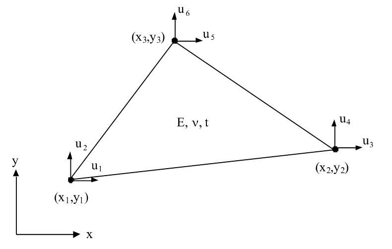

# Programutveckling för Tekniska Tillämpningar - Arbetsblad 2

## Strukturering av datorprogram

Utveckling av datorprogram är ett tidskrävande arbete. Det är därför viktigt att programkoden ut-formas på sådant sätt att modifiering och vidareutveckling underlättas. Detta innebär att program-met skall vara välstrukturerat och ha god läsbarhet. En beräkningsprocess kan i regel delas in i olika logiska delar. Vid programmeringen delas programmet lämpligen upp i subrutiner. Överföring av data görs via parametrarna i deklarationen och anropet. Valet av parametrar ska vara genomtänkt, så att överflödiga parametrar inte tas med. Överföring av parametrar med globala variabler bör undvikas, eftersom dessa ofta medför att parametrar som inte används i aktuellt underprogram kommer med, vilket försämrar överskådligheten.

För att ge programmet god läsbarhet bör valet av namn på variabler och subrutiner göras med omsorg, så att namnet säger något om funktionen. För att ytterligare öka läsbarheten används kommentarsatser för att i varje subrutin beskriva syfte, parametrarnas innebörd och de olika beräk-ningsstegen. Om ett program utformas enligt ovan blir det enkelt att modifiera det eller att utnyttja delar av det i andra sammanhang än det ursprungliga.

## Utformning av finita element program

En finita element analys kan oftast delas in i tre olika steg:

 1.	Inmatning av indata
 1.	Beräkning
 1.	Presentation av resultat

Varje sådant steg utförs ofta med hjälp av ett separat program. Data överförs då mellan de olika programmen med hjälp av filer. Ibland väljer man att, istället för att dela upp analysen i tre separata program, låta två eller alla tre stegen utföras av samma program.

I början av kursen väljer vi att inrikta oss på steg 2 enligt ovan. Enklare indata definieras direkt i Pyt-hon för att förenkla felsökning vid implementeringen av beräkningsdelen.

## Inlämningsuppgift 2

I denna inlämning skall stommen till beräkningsprogrammet skapas. En av problemtyperna:

 * Värmeledning
 * Grundvattenströmning
 * Spänningsberäkning (Plan spänning)
 
skall väljas. Det valda problemet kommer sedan att användas för alla kommande arbetsblad. Ni behöver alltså inte implementera ett program som hanterar alla problemtyperna.

En ny python-fil skapa, t ex flowmodel.py, vilken skall innehålla beräkningsdelen av programmet. Ge filen   ett namn som passar det problemområde ni valt. I början av filen anges följande deklarationer för de moduler som skall användas:

    # -*- coding: utf-8 -*-
    
    import numpy as np
    import calfem.core as cfc
    
För implementeringen kommer vi att använda objekt-orienterad programmering, dvs dela upp programmet i logiska objekt som kan återanvändas och möjliggöra utvidgning och återanvändning av koden. 4 logiska klasser kan identifieras för beräkningsmodellen:

 1. InputData - Lagrar de in-variabler som behövs för beräkningen.
 1. Solver - Implementerar lösningsrutinen för problemet.
 1. OutputData - Lagra de resultat som genereras vis lösningen av problemet.
 1. Report - Hanterar genereringen av indata- och utdatarapporter för programmet.
 
## Klassen InputData

Klassen InputData skall innehålla all indata som behövs för att utföra beräkningen. En första klassdefinition kan se ut som i följande kod:

    # -*- coding: utf-8 -*-

    import numpy as np
    import calfem.core as cfc
    import json

    class InputData(object):
        """Klass för att definiera indata för vår modell."""
        def __init__(self):
            
            self.version = 1
            
            self.t = 1
            self.ep = [self.t]

            # --- Elementegenskaper
            
            ...
            
            # --- Skapa indata för testexempel
            
            self.coord = np.array([
                [0.0, 0.0],
                [0.0, 0.12],
                ...
                [0.24, 0.12]
            ])

            # --- Elementtopolgi
                
            self.edof = np.array([
                [...],
                ...
                [...]
            ])

            # --- Laster

            self.loads = [
                [5, 6.0],
                [6, 6.0]
            ]

            # --- Randvillkor

            self.bcs = [
                [1, -15.0],
                [2, -15.0]
            ]
 
 > Alla **...** anger att kod måste läggas till.
 
## Klassen OutputData

OutputData-klassen skall användas för att lagra resultaten som skapas under beräkningen. Eftersom Python är ett dynamiskt språk kan beräkningsklassen själv lägga till resultatvariablerna i resultatobjektet, men det är alltid bra att skapa tomma variabler i klassen, så att den kan fungera självständigt. Ett exempel på resultat-klass visas i följande kod:

    class OutputData(object):
        """Klass för att lagra resultaten från beräkningen."""
        def __init__(self):
            self.a = None
            self.r = None
            self.ed = None
            self.qs = None
            self.qt = None
            
**None** kan användas som en generisk datatyp som kan användas för att kunna skapa variabler utan innehåll. Det är också möjligt att testa om en variabel är tilldelad genom en if-sats:

    if self.a == None:
        self.a = np.array(...) # Tilldela en riktigt datatyp om self.a == None 
    
## Klassen Solver

Klassen solver är ansvarig för att utföra själva beräkningen. Klassen kommer att ha en kontruktor, __init__(...) och en metod execute() för att utföra själva beräkningen. Kontruktorn skall ha två inparametrar, **inputData** och **outputData**, vilka är instanser av klasserna **InputData** och **OutputData**. Konstruktorn får följande utseende:

    class Solver(object):
        """Klass för att hantera lösningen av vår beräkningsmodell."""
        def __init__(self, inputData, outputData):
            self.inputData = inputData
            self.outputData = outputData

Inparametrarna tilldelas två klassvariabler, **self.inputData** och **self.outputData**.

Själva beräkningen skall utföras i metoden execute(...). Metoden hämtar indata från **self.inputData** för att ställa upp och utföra finita element beräkningen precis som ett vanliga CALFEM-program. För att förenkla hanteringen av invariabler kan lokala referenser till indata skapas enligt som visas i följande kod:

    class Solver(object):

        ...
            
        def execute(self):
            
            # --- Överför modell variabler till lokala referenser
            
            edof = self.inputData.edof
            cond = self.inputData.cond
            coord = self.inputData.coord
            dof = self.inputData.dof
            ep = self.inputData.ep
            loads = self.inputData.loads
            bcs = self.inputData.bcs       

Eftersom Python hanterar alla variabler som referenser är det ingen nackdel att göra dessa tilldelningar. Inga kopior på data kommer att göras. Variablerna behöver inte heller kopieras tillbaka till **self.inputData** då de lokala variablerna pekar på samma minnesinnehåll.

När beräkningen har genomförts skall **self.outputData** tilldelas referenserna till resultatet av beräkningen. Den globala styvhetsmatrisen eller f-vektorn behöver inte lagras här. Intressanta variabler är förskjutningsvektorn, reaktionskraftsvektorn och elementkrafter. Följande kod visar hur det kan se ut:

    class Solver(object):

        ...
            
        def execute(self):
        
            # --- Överför modell variabler till lokala referenser
            
            ...

            ... Beräkningskod ...
            
            # --- Överför modell variabler till lokala referenser

            self.outputData.a = a
            self.outputData.r = r
            self.outputData.ed = ed
            self.outputData.qs = qs
            self.outputData.qt = qt
            
## Klassen Report

När beräkingen är klar skall en rapport över indata och resultat genereras, detta görs av klassen **Report**. Klassen kommer att ha samma indata som **Solver**. 

För generering av rapporten kommer vi att använda Python:s inbyggda metod **__str__()**. Denna metod används för att implementera vad som skall ske när man använder **print(...)** på en instans av klassen eller när funktionen **str(...)** används för att konvertera klassens innehåll till en sträng. 

För att detta skall fungera behöver vi 2 extra metoder och en strängvariabel. Strängvariabeln kommer vi att fylla med textbeskrivningen av klassen. De extra metoderna används för att rensa och fylla strängvariabeln på innehåll. Följande kod visas implementeringen av **Report** klassen:

    class Report(object):
        """Klass för presentation av indata och utdata i rapportform."""
        def __init__(self, inputData, outputData):
            self.inputData = inputData
            self.outputData = outputData
            self.report = ""
            
        def clear(self):
            self.report = ""
            
        def addText(self, text=""):
            self.report+=str(text)+"\n"
                    
        def __str__(self):
            self.clear()
            self.addText()
            self.addText("-------------- Model input ----------------------------------")
            ...
            self.addText("Coordinates:")
            self.addText()
            self.addText(self.inputData.coord)
            ...
            return self.report
                           
## Huvudprogram

För att programmet skall fungera behöver vi ett huvudprogram. Följande kod visar hur man ofta brukar definiera ett huvudprogram i Python:

    # -*- coding: utf-8 -*-

    if __name__ == "__main__":
        print("Denna fil exekveras direkt och importeras inte.

Om en Python-fil importeras med **import**-satsen kommer variabeln **__name__** innehålla modulens namn, dvs namnet på källkodsfilen. Om man däremot anropar filen direkt med en Python-tolk kommer **__name__** innehålla värdet **__main__**. På detta sätt kan man se till att bara viss kod utförs om filen startas direkt med Python-tolken och på samma gång använda filen som en modul. Detta koncept används ofta i Python för att skapa test-funktioner för moduler. 

Ett huvudprogram för vårt finita element program som använder alla våra klasser kan då se ut så här:

    # -*- coding: utf-8 -*-

    import flowmodel as fm

    if __name__ == "__main__":
        
        inputData = fm.InputData()
        outputData = fm.OutputData()

        solver = fm.Solver(inputData, outputData)
        solver.execute()

        report = fm.Report(inputData, outputData)
        print(report)
        
I ovanstående huvudprogram importerar vi modulen **flowmodel** (flowmodel.py) som definierar våra klasser. Vi importerar den i namnrymden **fm**. Vi instantierar **InputData** och **OutputData** objekt för att hantera in- och utdata. En **Solver** instans, **solver** instantieras med objekten, **inputData** och **outputData** som indata. Beräkningen startas sedan genom att vi anropar metoder **solver.execute()**. Programmet avslutas med att vi skapar en instans av **Report** som vi sedan skriver ut på skärmen med en **print()**-sats. 

Exempel på en körning av programmet visas nedan:

    Solving equation system...
    Computing element forces...

    -------------- Model input ----------------------------------

    t = 1

    Conductivty:

    [[ 1.7   1.7 ]
     [ 1.7   1.7 ]
     [ 0.04  0.04]
     [ 0.04  0.04]]

    Coordinates:

    [[ 0.    0.  ]
     [ 0.    0.12]
     [ 0.12  0.  ]
     [ 0.12  0.12]
     [ 0.24  0.  ]
     [ 0.24  0.12]]

    Coordinate dofs:

    [[1]
     [2]
     [3]
     [4]
     [5]
     [6]]

    Topology:

    [[1 4 2]
     [1 3 4]
     [3 6 4]
     [3 5 6]]

    Element coordinates X

    [[ 0.    0.12  0.  ]
     [ 0.    0.12  0.12]
     [ 0.12  0.24  0.12]
     [ 0.12  0.24  0.24]]

    Element coordinates Y

    [[ 0.    0.12  0.12]
     [ 0.    0.    0.12]
     [ 0.    0.12  0.12]
     [ 0.    0.    0.12]]

    -------------- Results --------------------------------------

    Displacements:

    [[ -15.        ]
     [ -15.        ]
     [  -7.94117647]
     [  -7.94117647]
     [ 292.05882353]
     [ 292.05882353]]

    Reactions:

    [[ -6.00000000e+00]
     [ -6.00000000e+00]
     [ -3.55271368e-15]
     [ -1.02829510e-15]
     [ -1.77635684e-15]
     [ -8.88178420e-16]]

    Element forces:

    [[-100.   0.]
     [-100.   0.]
     [-100.   0.]
     [-100.   0.]]        

## Redovisning

Redovisningen av uppgiften skall innehålla:

 * Programlista
 * Utskrift från programkörning
 * Jämförande beräkning i CALFEM

## Elementtyper

### Plan skiva

 * u = förskjutning
 * x1,y1,x2,y2,x3,y3 = koordinater
 * E = elasticitetsmodul
 * v = Poissons tal
 * CALFEM för Python element : **plante/plants**

### Tvådimensionell värmeledning

 * T = temperatur
 * x1,y1,x2,y2,x3,y3 = koordinater
 * lambda,x, lambda,y = värmekonduktivitet
 * CALFEM för Python element : **flw2te/flw2te**

### Grundvattenströmning

 * phi = tryckhöjd
 * x1,y1,x2,y2,x3,y3 = koordinater
 * kx, ky = permeabiliteter
 * CALFEM för Python element : **flw2te/flw2ts**

## Testexempel

### Plan skiva

 * E = 20.8 GPa
 * t = 0.01 m
 * R_6,2 = -10.0 kN
 * u_1,1 = u_1,2 = u_2,1 = u_2,2 = 0.0 
 * Plan spänning
 * u_i,j  där i är nodnummer och j lokal frihetsgrad

### Tvådimensionell värmeledning

 * lambda_x1 = lambda_y1 = 1.7 W/mC
 * lambda_x2 = lambda_y2 = 0.04 W/mC
 * q_5 = q_6 = 6.0 W/m
 * T_1 = T_2 = -15.0 0C
 * t = 0.2 m

### Grundvattenströmning

 * k_x = k_y = 50 m/dag
 * q_6 = -400 m^2/dag 
 * phi_2 = phi_4 = 60.0 m
 * t = 1.0 m

