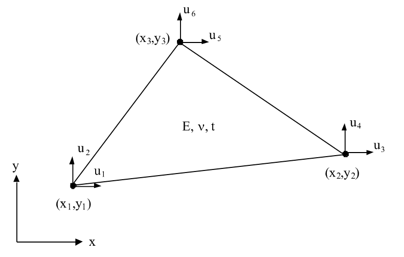
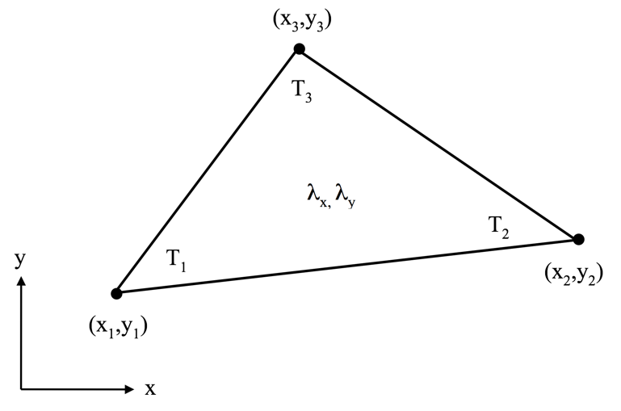
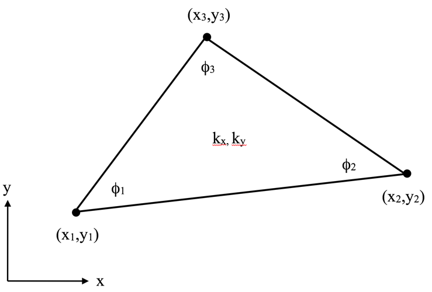
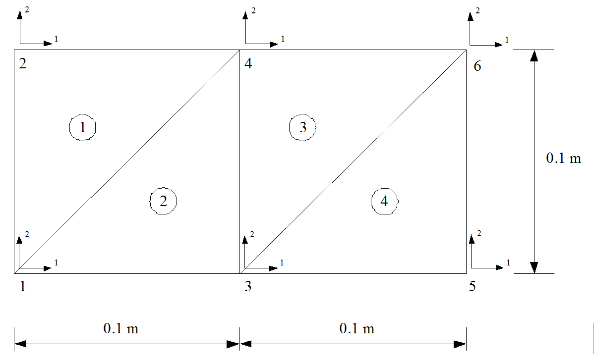
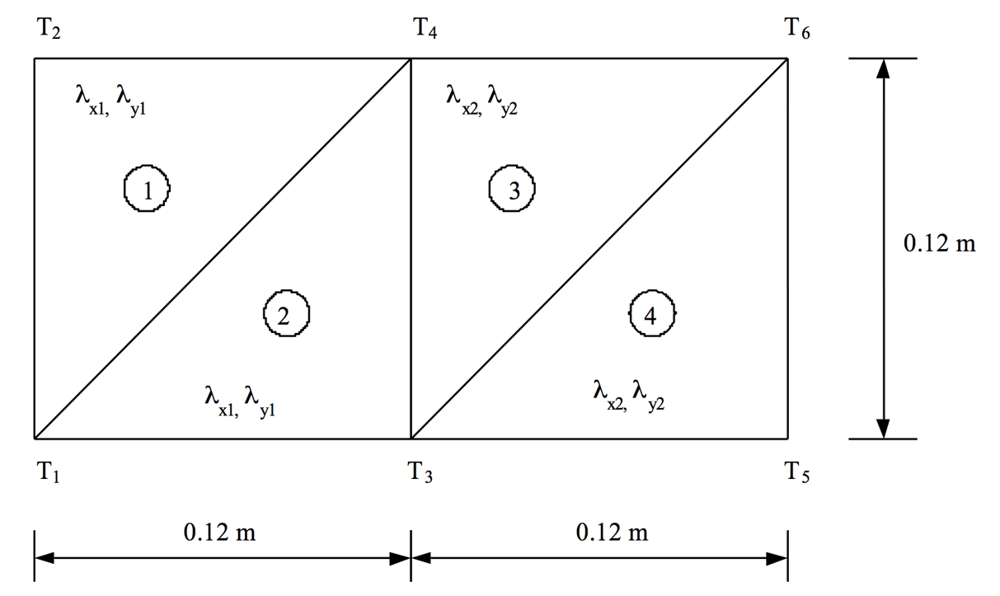
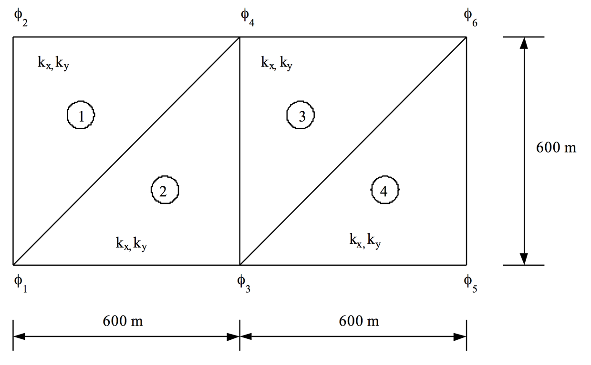

# Worksheet 2

!!! note "Important"

    When ** ... ** appears in the program examples, this indicates that there is no code that you yourselves must add. Variables and data structures are only examples. Depending on the type of problem you may need other data structures than those described in the code examples.

## Structuring of code

Software development is a time-consuming job. It is therefore important that the program code is designed in such a way that modification and further development can be facilitated. This means that software programs must be structured and have good readability. A calculation process can generally be divided into different logical parts. When programming, the program is assigned appropriately divided into subroutines. Transfer of data is done via the parameters in the declaration and call. The choice of parameters is to be thought out so that redundant parameters are avoided. 

To give the program readability, the choice of names for variables and subroutines is done with care, so that the name says something about the function. To further improve readability comments should be used in each subroutine to describe the purpose, meaning and parameters of the various computational steps. If a program is designed following the above, it is easy to modify it or to use parts of it for other purposes than the original.

## Structure of a finite element application

A finite element analysis can usually be divided into three different steps:

 1. Defining input data
 1. Calculation
 1. Presentation of results

Each such step is often performed by a separate program. The data is then transferred between the programs by using the files. Sometimes they choose to, instead of dividing the analysis into three separate applications, allow two or all three of the steps performed by the same program.

At the beginning of the course, we have chosen to focus on step 2 above. Easier inputs are defined directly in Python to simplify troubleshooting in the implementation of the calculation part.

In this worksheet, the backbone of the calculation program is implemented. The following problem types can be chosen (only one is to be implemented):

 * Thermal Conductivity
 * Groundwater Flow
 * Stress calculation (Plane stress)
 
The selected problem will then be used for all further worksheets. You do not need to implement a program that handles all problem types.

We begin by defining a python-module, flowmodel.py (chose a name depending on the selected problem type), which will include the calculation part of the program. At the beginning of the file, the following declarations for the modules to be used:

``` py
# -*- coding: utf-8 -*-

import numpy as np
import calfem.core as cfc
```
    
For the implementation, we will use object-oriented programming, ie, divide the program into logical objects that can be reused and allow for the expansion and reuse of code. 4 logical classes can be identified for the calculation model:

  * **ModelParams** - Stores the input variables required for calculation.
  * **ModelSolver** - Implements routine solution for the problem.
  * **ModelResult** - Storing the results generated thus solving the problem.
  * **ModelReport** - Manages the generation of input and output reports for the program.

## The ModelParams-class

The class input data must contain all inputs required to perform the calculation. Our first class definition may look like the following code:

``` py
# -*- coding: utf-8 -*-

import numpy as np
import calfem.core as cfc
import json

class ModelParams:
    """Class defining the model parameters"""
    def __init__(self):
        
        self.version = 1
        
        self.t = 1
        self.ep = [self.t]

        # --- Element properties
        
        ...
        
        # --- Create input for the example use cases
        
        self.coord = np.array([
            [0.0, 0.0],
            [0.0, 0.12],
            ...
            [0.24, 0.12]
        ])

        # --- Element topology
            
        self.edof = np.array([
            [...],
            ...
            [...]
        ])

        # --- Loads

        self.loads = [
            [5, 6.0],
            [6, 6.0]
        ]

        # --- Boundary conditions

        self.bcs = [
            [1, -15.0],
            [2, -15.0]
        ]
```

!!! note "Important"

    All ** ... ** indicates that the code must be added.

## The ModelResult-class

**ModelResult**-class to be used to store the results generated during the calculation. Because Python is a dynamic language that can calculate the class itself and add to the result variables in the result object, but it's always good to create empty variables in the class so that it can function independently. An example of the **ModelResult** class is shown in the following code:

``` py
class ModelResult:
    """Class for storing results from calculations."""
    def __init__(self):
        self.a = None
        self.r = None
        self.ed = None
        self.qs = None
        self.qt = None
``` 

!!! note "Good to know"

    ** None ** can be used as a generic data type that can be used to create variables without content. It is also possible to test if a variable is assigned by an if statement:

        if self.a == None:
            self.a = np.array(...) # Tilldela en riktigt datatyp om self.a == None 
    
## The ModelSolver-class

The class **ModelpSolver** is responsible for performing the actual calculation. The class will have a kontruktor, __init__(...) and a method execute() to perform the actual calculation. Constructor must have two input parameters, **model_params** and **model_result**, which are instances of the classes **ModelParams** and **ModelResult**. The constructor will look like the following:

``` py
class Solver:
    """Class for performing the model computations."""
    def __init__(self, model_params, model_result):
        self.model_params = model_params
        self.model_result = model_result
```

The input parameters are assigned two class variables, **self.model_params** ** and **self.model_result**.

The calculation to be performed in the execute (...). The method retrieves input from **self.model_params** to set up and perform finite element calculations just like a regular Calfem programs. To simplify management of input variables can be local references to the input data is created according to the following code:    class Solver:

``` py
    ...
        
    def execute(self):
        
        # --- Assign shorter variable names from model properties
        
        edof = self.model_params.edof
        cond = self.model_params.cond
        coord = self.model_params.coord
        dof = self.model_params.dof
        ep = self.model_params.ep
        loads = self.model_params.loads
        bcs = self.model_params.bcs       
```

Because Python handles all the variables that references it is no disadvantage to make these assignments. No copies of the data will be made. The variables need not be copied back to **self.model_params** then the local variables pointing to the same memory contents.

After the calculation is completed, the **self.model_result** is assigned the result of the calculation. The global stiffness matrix, **K** or the load vector **f** need not be stored here. Hot variables is the displacement vector, the reaction force vector and the element forces. The following code shows how this might look like:

``` py
class Solver:

    ...
        
    def execute(self):
    
        # --- Assign shorter variable names from model properties
        
        ...

        ... Beräkningskod ...
        
        # --- Store results in model_results

        self.model_result.a = a
        self.model_result.r = r
        self.model_result.ed = ed
        self.model_result.qs = qs
        self.model_result.qt = qt
```
            
## The ModelReport-class

When the calculation has been completed, a report of input parameters and results is generated, this is done by the **ModelReport**-class. The class will have the same input parameters as the **ModelSolver**-class.

For the generation of the report, we will use Python's built-in method **__str__()**. This method is used to implement what should happen when using print ** (...) ** on an instance of the class or the function str ** (...) ** is used to convert the class content to a string.

For this to work, we need two additional methods and a string variable. The string variable we will fill with the text description of the class. The extra methods are used to clean and fill the string with content. The following code shows the implementation of ** Report ** class:

``` py
class ModelReport:
    """Class for presenting input and output parameters in report form."""
    def __init__(self, model_params, model_result):
        self.model_params = model_params
        self.model_result = model_result
        self.report = ""
        
    def clear(self):
        self.report = ""
        
    def add_text(self, text=""):
        self.report+=str(text)+"\n"
                
    def __str__(self):
        self.clear()
        self.add_text()
        self.add_text("-------------- Model input ----------------------------------")
        ...
        self.add_text("Coordinates:")
        self.add_text()
        self.add_text(cfu.str_disp_array(self.model_params.coord, headers=["x (m)", "y (m)"]))
        ...
        return self.report
```

!!! note "Nice looking tables"

    The CALFEM commands starting with **cfu.str_disp_xxx(...)** are equivalent of the the **disp_xxx(...)** commands, but instead of printing to the terminal or notebook they return a string of the output. We use the command **cfu.str_disp_array(...)** to return a string with a table representation of the array as a string, which we add to the report in the **.add_text()** method. It is also possible to use the **tabulate** module as shown in the [guides section](data_in_tables.md).

                           
## Main program

For the program to work, we need a main program. The following code shows how to implement a main program in Python:

``` py
# -*- coding: utf-8 -*-

if __name__ == "__main__":
    print("This will is executed as a script and not imported.")
```

If a Python file is imported with the **import** statement, the variable ** __ name __ ** will contain the module name, ie the name of the source file. However, if you call the file directly with a Python interpreter ** __ name__ ** will contain the value ** __ main __ **. In this way, you can ensure that only certain code is executed if the file is started directly with the Python interpreter and at the same time use the file as a module. This concept is often used in Python to create test functions for modules.

A main program of our finite element program that uses all of our classes can then look like this:

``` py
# -*- coding: utf-8 -*-

import flowmodel as fm

if __name__ == "__main__":
    
    model_params = fm.ModelParams()
    model_result = fm.ModelResult()

    solver = fm.ModelSolver(model_params, model_result)
    solver.execute()

    report = fm.ModelReport(model_params, model_result)
    print(report)
```
        
In the above main program, we import the module **flowmodel** (flowmodel.py) that defines our classes. We import the module as **fm**. We instantiates **fm.ModelParams** and **fm.ModelResult** objects to manage our input parameters and results. A **ModelSolver**-instance, the **fm.ModelSolver** is instantiated with the parameters, **model_params** and **model_results** as input. The calculation is then started by calling the methods **solver.execute()**. We end the program by creating a **fm.ModelReport** object which we display on the screen with the **print()** statement. 

Example of a running program is shown below:

    Solving equation system...
    Computing element forces...

    -------------- Model input ----------------------------------

    t = 1

    Conductivty:

    [[ 1.7   1.7 ]
     [ 1.7   1.7 ]
     [ 0.04  0.04]
     [ 0.04  0.04]]

    Coordinates:

    [[ 0.    0.  ]
     [ 0.    0.12]
     [ 0.12  0.  ]
     [ 0.12  0.12]
     [ 0.24  0.  ]
     [ 0.24  0.12]]

    Coordinate dofs:

    [[1]
     [2]
     [3]
     [4]
     [5]
     [6]]

    Topology:

    [[1 4 2]
     [1 3 4]
     [3 6 4]
     [3 5 6]]

    Element coordinates X

    [[ 0.    0.12  0.  ]
     [ 0.    0.12  0.12]
     [ 0.12  0.24  0.12]
     [ 0.12  0.24  0.24]]

    Element coordinates Y

    [[ 0.    0.12  0.12]
     [ 0.    0.    0.12]
     [ 0.    0.12  0.12]
     [ 0.    0.    0.12]]

    -------------- Results --------------------------------------

    Displacements:

    [[ -15.        ]
     [ -15.        ]
     [  -7.94117647]
     [  -7.94117647]
     [ 292.05882353]
     [ 292.05882353]]

    Reactions:

    [[ -6.00000000e+00]
     [ -6.00000000e+00]
     [ -3.55271368e-15]
     [ -1.02829510e-15]
     [ -1.77635684e-15]
     [ -8.88178420e-16]]

    Element forces:

    [[-100.   0.]
     [-100.   0.]
     [-100.   0.]
     [-100.   0.]]   
     
## Reading and writing to a file using JSON

An important part of a calculation program is being able to read and write input files. In most cases, the problems are so large that they can not be defined in the program code. In this program, we will use JSON (JavaScript Object Notation) as the format of the files we will write. The following code is an example of how a JSON file might look like.

``` json
{"employees":[
    {"firstName":"John", "lastName":"Doe"},
    {"firstName":"Anna", "lastName":"Smith"},
    {"firstName":"Peter", "lastName":"Jones"}
]}
```
    
The file is very similar to the syntax that Python uses dictionaries. What makes the format attractive is that we do not need to write it to the file ourselves as Python has a built-in library to read and write files of this type.

To implement the functionality to read and write JSON-files in our program, we add the following imports at the beginning of our module file:

``` py hl_lines="5"
# -*- coding: utf-8 -*-

import numpy as np
import calfem.core as cfc
import json 
```

We start by implementing writing to a file as we have all input parameters required for this. We add a method **save()** in the **ModelParams**-class:
    
``` py 
class ModelParams:
    """Class defining the model parameters."""
    
    ...

    def save(self, filename):
        """Save input to file."""
        
        ...
```

To define the structure of that which is to be stored, but also to make it easy to read data, we will start from a dictionary as the base for what should be written and read to File. In the **save()**-method we add the following code to define a parameter dictionary:

``` py
        model_params = {}
        model_params["version"] = self.version
        model_params["t"] = self.t
        model_params["ep"] = self.ep
```
                        
The **model_params["version"]** entry is a good way of keeping track of the version of the file format that is written. This can later be used to read a different version of the file correctly.

One problem we need to handle is that the JSON module can't handle NumPy arrays. This is solved by converting our numpy arrays to lists. In the following code, we convert the array **self.coord** to a list using the **.tolist()** method in NumPy.

``` py
        model_params["coord"] = self.coord.tolist()
```
            
When the input parameters have been defined, we can open a file for writing and writing the dictionary to file using the **json.dumps(...)** function.

``` py
        ofile = open(filename, "w")
        json.dump(model_params, ofile, sort_keys = True, indent = 4)
        ofile.close()
```

**sort_keys** and **indent** ensure that the file written is nicely formatted.

To load an existing JSON file we do the proecdure in reverse. We read the entire file into a string of characters which we then convert back to a dictionary function using the **json.load(...)**-function.

``` py
    def load(self, filename):
        """Read input from file."""
        
        ifile = open(filename, "r")
        model_params = json.load(ifile)
        ifile.close()

        self.version = model_params["version"]
        self.t = model_params["t"]
        self.ep = model_params["ep"]
```

The **self.coord**-array must now be converted back to a numpy array. This is done with the numpy function **np.asarray(...)**.

``` py
        self.coord = np.asarray(model_params["coord"])
```
        
The complete **ModelParams** class with read and write functionality is shown below:

``` py
class ModelParams:
    """Klass för att definiera indata för vår modell."""

    def save(self, filename):
        """Spara indata till fil."""

        model_params = {}
        model_params["version"] = self.version
        model_params["t"] = self.t
        model_params["ep"] = self.ep
        ...
        model_params["coord"] = self.coord.tolist()
        ...

        ofile = open(filename, "w")
        json.dump(model_params, ofile, sort_keys = True, indent = 4)
        ofile.close()

    def load(self, filename):
        """Läs indata från fil."""
        
        ifile = open(filename, "r")
        model_params = json.load(ifile)
        ifile.close()

        self.version = model_params["version"]
        self.t = model_params["t"]
        self.ep = model_params["ep"]
        ...
        self.coord = np.asarray(model_params["coord"])
        ...
```

## Submission and accounting

To complete the worksheet you must:

  * Complete the implementation of the **ModelParams**-class with all the required input to solve the chosen problem. Procedures to save and read from JSON files will also be implemented for all input variables.
  * Complete the implementation of the **ModelSolver**-class with a finite element solver implemented with the methods that are described in CALFEM.
  * Complete the implementation of the **ModelReport**-class with a complete transcript of the input and output variables with descriptive texts.

The submission shall consist of a zip file (or other archive format) consisting of:

  * All the Python files. (.py Files)
  * An example of a saved file JSON.
  * Printing from applications run.
  * Comparative calculation of Calfem for MATLAB.

## Element types

### Plate element



 * u = förskjutning
 * x1,y1,x2,y2,x3,y3 = koordinater
 * E = elasticitetsmodul
 * v = Poissons tal
 * CALFEM för Python element : **plante/plants**

### 2-dimensional heat flow



 * T = temperatur
 * x1,y1,x2,y2,x3,y3 = koordinater
 * lambda,x, lambda,y = värmekonduktivitet
 * CALFEM för Python element : **flw2te/flw2te**

### Groundwater flow



 * phi = tryckhöjd
 * x1,y1,x2,y2,x3,y3 = koordinater
 * kx, ky = permeabiliteter
 * CALFEM för Python element : **flw2te/flw2ts**

## Testexempel

### Plan skiva



 * E = 20.8 GPa
 * t = 0.01 m
 * R_6,2 = -10.0 kN
 * u_1,1 = u_1,2 = u_2,1 = u_2,2 = 0.0 
 * Plan spänning
 * u_i,j  där i är nodnummer och j lokal frihetsgrad

### Two-dimemsional heat flow



 * lambda_x1 = lambda_y1 = 1.7 W/mC
 * lambda_x2 = lambda_y2 = 0.04 W/mC
 * q_5 = q_6 = 6.0 W/m
 * T_1 = T_2 = -15.0 0C
 * t = 0.2 m

### Groundwater flow



 * k_x = k_y = 50 m/dag
 * q_6 = -400 m^2/dag 
 * phi_2 = phi_4 = 60.0 m
 * t = 1.0 m

