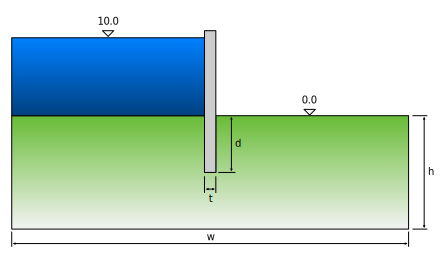
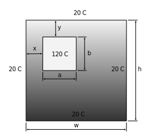
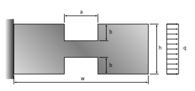

# Worksheet 3

!!! note "Important"

    When **...** appears in the program examples, this indicates that there is no code that you yourselves must add. Variables and data structures are only examples. Depending on the type of problem you may need other data structures than those described in the code examples.

## General

In this worksheet contains the following elements:

  1. The classes implemented in sheet 2 are adapted to implementa geometric model that describes the calculation model parametrically.
  2. load and save functions must be adapted to handle the geometric model.
  2. grid generation is implemented using **GMSH** and the results visualized.
  3. Visualization of the model to be made with **calfem.vis_mpl** functions.

## Geometric model

In this worksheet, we will update our classes to manage a geometric model that is the basis for the mesh generation in our **ModelSolver**-class. Instead of defining the model in terms of nodes and elements, we define it instead with parameters such as width and height.

In this worksheet, we use some additional Calfem modules. Add the following modules in the module where your classes are defined:

``` py hl_lines="4-6"
import json, math, sys

import calfem.core as cfc
import calfem.geometry as cfg
import calfem.mesh as cfm
import calfem.vis_mpl as cfv
import calfem.utils as cfu

import numpy as np
import tabulate as tb
``` 

## Updating the ModelParams-class

**ModelParams**-class must be updated to handle a parametric model described using parameters instead of defining the problem at the element level. For the groundwater problem, parameters **w** **t** , **d**  and **h** are used to describe the geometry and **EP**  **kx** and **ky** to describe elements properties. Variables for loads and boundary conditions can be maintained. The difference now is that instead of storing the degrees of freedom and value we now store the boundary condition marker and value.

All variables such as **coord** and **edof** describing the input of element level to be moved to the **ModelSolver** - class because they will be created when the elements are generated in the solver.

The geometry will be defined with the classes and functions of  **calfem.geometry**. To ensure that the **ModelSolver** method **execute()** will get an up-to-date geometry definition we add a method **geometry()** in the **ModelParams**-class, which will return a **cfg.Geometry**-instance. An example of how this method might look like the following example:

``` py
class ModelParams(object):
    """Class defining our model parameters"""
    ...
    
    def geometry(self):
        """Skapa en geometri instans baserat på definierade parametrar"""
        
        # --- Create a geometry instance to store the geometry
        #     description
        
        g = cfg.Geometry()
        
        # --- Create shorter variable references to class attributes
        
        w = self.w
        h = self.h
        t = self.t
        d = self.d
        
        # --- Points in the geometry are created with the .point() method
        
        g.point([0, 0])
        g.point([w, 0])
        g.point([w, h])
        
        ...
        
        # --- Lines and splies are created with the .spline method.
        
        g.spline([0, 1])            
        g.spline([1, 2])           
        g.spline([2, 3], marker=...) # <-- Use marker to define
                                     #     lines that will have  
                                     #     boundary conditions 
                                     #     and loads.
        
        ...
        
        # --- Surface defining what defines the geometry
        
        g.surface([0,1, ... ,6,7])

        # --- Return the generated geometry.
        
        return g
```

## Updating the ModelSolver-class

In the **ModelSolver**-class, we must add a call to the mesh generator in the **calfem.mesh**-module, **GmshMeshGenerator**. This will give us the element coordinates, topology, and variables that can be used for the connection between geometry and element mesh. An example of how this might look in the **execute()**-method is shown below:

``` py
class ModelSolver(object):
    """Class implementing the solver for our model."""

    ...
                
    def execute(self):
        """Perform finite element computation."""
        
        # --- Create references (shortcuts) to input data variables
        
        version = self.model_params.version
        ep = self.model_params.ep

        ...
        
        
        # --- Call the mode
        
        geometry = self.model_params.geometry()        
        
        # --- Mesh generation
        
        el_type = 3        # <-- four node element flw2i4e
        dofs_per_node = 1  # <-- scalar problem
        
        mesh = cfm.GmshMesh(geometry)
        mesh.el_size_factor = 0.5     # <-- max area for elements
        mesh.el_type = el_type
        mesh.dofs_per_node = dofs_per_node
        mesh.return_boundary_elements = True
        
        coords, edof, dofs, bdofs, element_markers, boundary_elements = mesh.create()
```
            
Element generation and assemblation do not need to be changed from worksheet 2. However, one must update the handling of loads and boundary conditions, as we are now working load markers instead of degrees of freedom. Use the functions **apply_bc(...)** and **apply_force_total(...)**/**apply_tracion_linear_element(...)** available in the **calfem.utils** module.

Solving equations and calculating element forces do not need to be changed. However, we need to store the generated variables **coord**, **edof**, **geometry** and other output variables needed to visualize the results.

!!! note "Tip"

    It may also be useful to define a variable in the **ModelParams** - class to set the maximum size of the generated elements such as **el_size_factor**, which can then be assigned to **cfm.GmshMesh** - class attribute **el_size_factor**.

## Using the parametric model

The idea of the parametric description of the problem is that a user easily be able to specify their area of concern in the code without having to go into the module for the model. This is shown in the following code:

``` py
# -*- coding: utf-8 -*-

import flowmodel as fm

if __name__ == "__main__":
    
    model_params = fm.ModelParams()

    model_params.w = 100.0
    model_params.h = 10.0
    model_params.d = 5.0
    model_params.t = 0.5
    model_params.kx = 20.0
    model_params.ky = 20.0
    
    ...
```

In this way, one can also easily study the effect of, an increasing depth of the tongue in the ground and find out how this affects the flow, as shown below:

``` py
# -*- coding: utf-8 -*-

import flowmodel as fm
import numpy as np

if __name__ == "__main__":
    
    dRange = np.linspace(3.0, 7.0, 10).tolist()
    
    for d in dRange:
    
        print("-------------------------------------------")    
        print("Simulating d = ", d)
    
        model_params = fm.ModelParams()
    
        model_params.w = 100.0
        model_params.h = 10.0
        model_params.d = d
        model_params.t = 0.5
        model_params.kx = 20.0
        model_params.ky = 20.0
        
        model_results = fm.ModelResults()
    
        solver = fm.ModelSolver(model_params, model_results)
        solver.execute()
        
        print("Max flow = ", np.max(model_result.maxFlow))        
```

## ModelReport class

In the **ModelReport**-class, we need to add the ability to print the geometry description.

## Visualisation with a new class ModelVisualisation

In worksheet 2 the only output from the calculations where the printout from the **ModelResult**-class. To interpret the results in text format can be difficult. We must therefore use routines from the CALFEM visualization module **calfem.vis**. The visualization will be implemented in the new class **ModeVisualization**. This class has the same input parameters as the **ModelResult**-class with references to instances of **ModelParams** and **ModelResult**.

There are a number of visualization features in Calfem. In this sheet, the following visualizations are implemented:

 * Geometry - draw_geometry(...)
 * Generated network - draw_mesh(...)
 * Deformed networks - draw_mesh(...) (for example voltage)
 * Element Values ​​- draw_element_values​​(...)
 * Node values ​​- draw_nodal_values​(...)
 
Documentation for these procedures, see the user manual for [mesh generation routines](https://calfem-for-python.readthedocs.io/en/latest/calfem_mesh_guide.html).
      
The following code shows how the class can be implemented with a method for visualising the model geometry.

``` py
class ModelVisualisation(object):
    def __init__(self, model_params, model_result):
        self.model_params = model_params
        self.model_result = model_result
        
    def show(self):
        
        geometry = self.model_result.geometry
        a = self.model_result.a
        max_flow = self.model_result.max_flow
        coords = self.model_result.coords
        edof = self.model_result.edof
        dofs_per_node = self.model_result.dofs_per_node
        el_type = self.model_result.el_type
        
        cfv.figure() 
        cfv.draw_geometry(geometry, title="Geometry")
        
        ...
                    
    def wait(self):
        """This method make sure the windows are kept updated."""

        cfv.show_and_wait()
```
            
The **ModelVisualiation**-class is then added to the main program in the code shown:

``` py
# -*- coding: utf-8 -*-

import flowmodel as fm

if __name__ == "__main__":
    
    model_params = fm.ModelParams()

    model_result = fm.OutputData()

    solver = fm.Solver(model_params, model_result)
    solver.execute()

    report = fm.Report(model_params, model_result)
    print(report)
    
    vis = fm.ModelVisualisation(model_params, model_result)
    vis.show()
    vis.wait()        
```

**vis.wait()** must be called last in the main program, since this function does not return until the final visualization window closes.

## Submission and reporting

It is to be done in this worksheet are:

 * Change **ModelPArams**-class to describe the problem parametrically according to the examples described at the end of this sheet. Create a method **geometry()** that returns a **cfg.Geometry**-instance with geometry defined based on the parameter description.
 * Update the **ModelSolver**-class so that this creates an element mesh using **cfm.GmshMeshGenerator**-class. Save maximum flows / maxspänningar (von Mises) and store these in the **ModelResult**-class.
 * Complete the implementation of the **ModelVisualization**-class to handle visualisation of geometry, element mesh, element flows and node values.
 * Makes a parameter study wherein one of the parameters is varied and maximum flow/max stress is plotted relative to the selected parameter. Create a new main program for parameter study.

The submission shall consist of a zip file (or other archive format) consisting of:

 * All the Python files. (.py files)
 * An example of a saved file JSON.
 * Printing from program execution.
 * Printing of the parameter study.

## Exempelproblem

### Grundvattenströmning
 


h = 10.0, w = 100.0, d = 5.0, t = 0.5

k_x = k_y = 20 m/dag

### Tvådimensionell värmeledning
 


h = 0.1, w = 0.1, a = 0.01, b = 0.01, x = 0.01, y = 0.01

lambda_x = lambda_y = 1.7 W/m C

### Plan skiva
 


h = 0.1, w = 0.3, a = 0.05, b = 0.025

E = 2.08e10, ν = 0.2, t = 0.15

q = 100 kN / m


