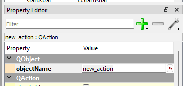

# Programutveckling för Tekniska Tillämpningar - Arbetsblad 4

> **Att tänka på:** När **...** visas i programexemplen anger detta att det saknas kod som ni själva måste lägga till. Variabler och datastrukturer är bara exempel. Beroende på problemtyp kan man behöva andra datastrukturer än de som är beskrivna i kodexemplen.

## Allmänt

I detta arbetsblad innehåller följande moment:

 1. Skapa gränssnitt i Qt Designer.
 1. Skapa ett huvudprogram och klass för grafiskt gränssnitt.
 1. Skapa en trådklass för att kunna hantera beräkningar i bakgrunden.
 1. Uppdatera visualiseringsklassen för att visa enstaka fönster, samt att kunna stänga alla öppnade fönster.

 
## Grafiskt gränssnitt i Qt Designer
 
Det grafiska gränssnittet skapas i programmet Qt Designer. I detta program skapas en beskrivning av gränssnittet i XML som kommer att läsas in av vårt program. 

Qt Designer kan startas direkt från Spyder genom att klicka på **Tools/External tools/Qt Designer** i menyn. Programmet ser ut som i följande figur:

När programmet startats visas en dialogruta för att välja vilken typ av formulär som skall skapas. För vårt huvudfönster väljer vi **Main Window** och klickar på **Create**.

Mitt i fönstret böde det nu finnas ett fönster med namnet **MainWindow - untitled** enligt följande figur:

Qt Designer är uppdelat i 5 huvudsakliga vyer:

 * **Widget Box** till vänster i fönstret visar alla tillgängliga kontroller vi kan använda för att designa gränssnittet.
 * **Designytan** mitten i fönstret används för att välja och redigera de skapade kontrollerna.
 * **Object Inspector** visar ett hierarkiskt träd över alla kontroller i projektet. Detta träd motsvarar också den objektstruktur som kommer att skapas när beskrivningen läses in i Python-koden.
 * **Property Editor** visar egenskaperna för en vald kontroll i gränssnittet. Här kan utseende och andra egenskaper för kontrollerna styras.
 * **Signal/Slot Editor** Hanterar hur kontrollerna rent händelsemässigt är sammankopplade. I denna uppgift kommer vi _inte_  att använda denna, då denna sammankoppling kommer att göras i vår Python-kod.
 
### Menyrad

Det första vi skall göra är att skapa en menyrad till vårt program. I menyraden lägger vi funktioner som:

 1. Skapa ny modell - **File/New**
 1. Öppna existerande modell - **File/Open**
 1. Spara modell - **File/Save**
 1. Spara modellen med ett annat filnamn - **File/Save as...**
 1. Avsluta programmet - **File/Exit**
 1. Starta en beräkning - **Calc/Execute**
 
Menyer skapas genom att klicka på **Type here** i huvudfönstret och ange namnet på huvudmenyn. I följande exempel definieras huvudmenyn **File**.
 

En undermeny till en huvudmeny skapas kommer Qt Designer att automatiskt skapa en s.k. Action. Dessa visas i **Action Editor** längst ned till höger i fönstret.

Namnen på en **Action** kan ändras genom att man väljer en action in editorn och ändrar på namnet i **Property Editor** enligt följande figur:

Namnen som ges här motsvarar de namn som kommer att användas i Python. Försök skapa namn utan mellanrum. 

Färdigställ hela menyn enligt den tidigare listan med menyfunktioner.

### Kontroller för inmatning av parametrar

För att kunna redigera vår modell måste vi skapa kontroller för detta i Qt Designer. De kontroller kan använda är **QLineEdit** och **QLabel**. QLineEdit används för att kunna ange värden i textutor på skärmen. QLabel använder vi för att beskriva vad textutorna beskriver för parameter.

Kontroller skapas genom att man drar kontrollen från **Widget Box** och släpper dem på formulärfönstret. Följande bild visar ett antal kontroller skapade på detta sätt med tillhörande objektnamn.

Texten för **QLabel** kontrollerna ändras genom att välja kontrollen och ändra egenskapen **text** i **Property Editor** enligt följande figur:

### Knappar för visualisering

För att kunna visa visualiseringarna behöver vi också ett antal knappar för detta. Skapa följande knappar (**QPushButton**) till höger om de tidigare kontrollerna (Bry er inte om exakt placering. Räcker med ungefärlig placering.):

 * text: **Geometry** - namn: **showGeometryButton**  
 * text: **Mesh** - namn: **showMeshButton**  
 * text: **Nodal values** - namn: **showNodalValuesButton**  
 * text: **Element values** - namn: **showElementValuesButton**
 
Följande figur visar ungefärligt utseende:
 

### Textruta för rapport

För att visa rapporten kommer vi att använda en **QPlainTextEdit**-kontroll. Denna kontroll kan hantera text bestående av flera rader. Skapa en sådan kontroll med namnet **reportEdit**. 

Det färdiga fönstret bör nu se ut som i följande figur:

### Ordning och reda på kontroller

  

**UNDER KONSTRUKTION**