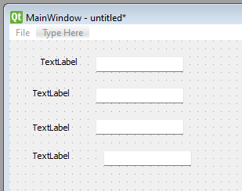
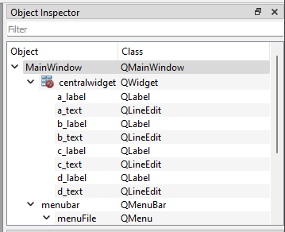
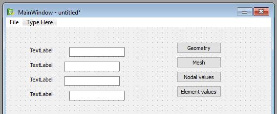
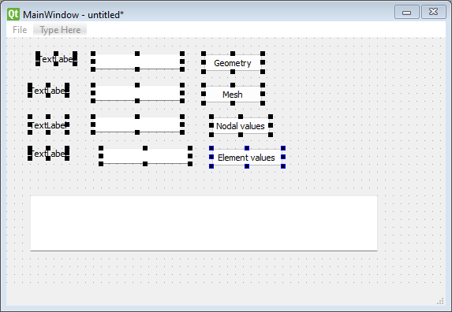
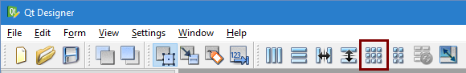
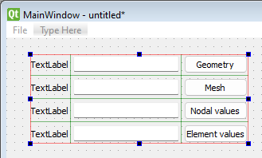
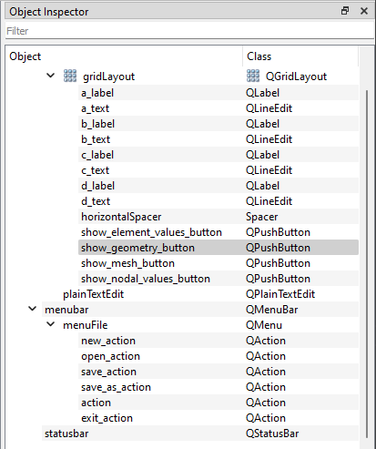

# Programutveckling för Tekniska Tillämpningar - Arbetsblad 4

> **Att tänka på:** När **...** visas i programexemplen anger detta att det saknas kod som ni själva måste lägga till. Variabler och datastrukturer är bara exempel. Beroende på problemtyp kan man behöva andra datastrukturer än de som är beskrivna i kodexemplen.

## Allmänt

I detta arbetsblad innehåller följande moment:

 1. Skapa gränssnitt i Qt Designer.
 1. Skapa ett huvudprogram och klass för grafiskt gränssnitt.
 1. Skapa en trådklass för att kunna hantera beräkningar i bakgrunden.
 1. Uppdatera visualiseringsklassen för att visa enstaka fönster, samt att kunna stänga alla öppnade fönster.
 
## Grafiskt gränssnitt i Qt Designer
 
Det grafiska gränssnittet skapas i programmet Qt Designer. I detta program skapas en beskrivning av gränssnittet i XML som kommer att läsas in av vårt program. 

Qt Designer kan startas direkt från Spyder genom att klicka på **Tools/External tools/Qt Designer** i menyn. Programmet ser ut som i följande figur:

När programmet startats visas en dialogruta för att välja vilken typ av formulär som skall skapas. För vårt huvudfönster väljer vi **Main Window** och klickar på **Create**.

Mitt i fönstret böde det nu finnas ett fönster med namnet **MainWindow - untitled** enligt följande figur:

Qt Designer är uppdelat i 5 huvudsakliga vyer:

 * **Widget Box** till vänster i fönstret visar alla tillgängliga kontroller vi kan använda för att designa gränssnittet.
 * **Designytan** mitten i fönstret används för att välja och redigera de skapade kontrollerna.
 * **Object Inspector** visar ett hierarkiskt träd över alla kontroller i projektet. Detta träd motsvarar också den objektstruktur som kommer att skapas när beskrivningen läses in i Python-koden.
 * **Property Editor** visar egenskaperna för en vald kontroll i gränssnittet. Här kan utseende och andra egenskaper för kontrollerna styras.
 * **Signal/Slot Editor** Hanterar hur kontrollerna rent händelsemässigt är sammankopplade. I denna uppgift kommer vi _inte_  att använda denna, då denna sammankoppling kommer att göras i vår Python-kod.
 
### Menyrad

Det första vi skall göra är att skapa en menyrad till vårt program. I menyraden lägger vi funktioner som:

 1. Skapa ny modell - **File/New**
 1. Öppna existerande modell - **File/Open**
 1. Spara modell - **File/Save**
 1. Spara modellen med ett annat filnamn - **File/Save as...**
 1. Avsluta programmet - **File/Exit**
 1. Starta en beräkning - **Calc/Execute**
 
Menyer skapas genom att klicka på **Type here** i huvudfönstret och ange namnet på huvudmenyn. I följande exempel definieras huvudmenyn **File**.
 

En undermeny till en huvudmeny skapas kommer Qt Designer att automatiskt skapa en s.k. Action. Dessa visas i **Action Editor** längst ned till höger i fönstret.

Namnen på en **Action** kan ändras genom att man väljer en action in editorn och ändrar på namnet i **Property Editor** enligt följande figur:

Namnen som ges här motsvarar de namn som kommer att användas i Python. Försök skapa namn utan mellanrum. 

Färdigställ hela menyn enligt den tidigare listan med menyfunktioner.

### Kontroller för inmatning av parametrar

För att kunna redigera vår modell måste vi skapa kontroller för detta i Qt Designer. De kontroller kan använda är **QLineEdit** och **QLabel**. QLineEdit används för att kunna ange värden i textutor på skärmen. QLabel använder vi för att beskriva vad textutorna beskriver för parameter.

Kontroller skapas genom att man drar kontrollen från **Widget Box** och släpper dem på formulärfönstret. Följande bild visar ett antal kontroller skapade på detta sätt med tillhörande objektnamn.

Texten för **QLabel** kontrollerna ändras genom att välja kontrollen och ändra egenskapen **text** i **Property Editor** enligt följande figur:

### Knappar för visualisering

För att kunna visa visualiseringarna behöver vi också ett antal knappar för detta. Skapa följande knappar (**QPushButton**) till höger om de tidigare kontrollerna (Bry er inte om exakt placering. Räcker med ungefärlig placering.):

 * text: **Geometry** - namn: **showGeometryButton**  
 * text: **Mesh** - namn: **showMeshButton**  
 * text: **Nodal values** - namn: **showNodalValuesButton**  
 * text: **Element values** - namn: **showElementValuesButton**
 
Följande figur visar ungefärligt utseende:
 

### Textruta för rapport

För att visa rapporten kommer vi att använda en **QPlainTextEdit**-kontroll. Denna kontroll kan hantera text bestående av flera rader. Skapa en sådan kontroll med namnet **reportEdit**. 

Det färdiga fönstret bör nu se ut som i följande figur:

### Ordning och reda på kontroller

Fram till nu har vi placera ut kontrollerna ungefärligt. För att se till att kontrollerna placeras på ett mer ordentligt och skalbart sätt skall vi använda verktyget för grid-layout och radlayout.

Först skapar vi en grid-layout av etiketter, textutor och knappar. Markera dessa kontroller i Qt Designer:

Klicka sedan på grid-verktyget:

Nu skapar Qt Designer automatiskt en grid-layout av de valda kontrollerna:

Det är lite trångt mellan textutorna och knapparna. Lägg in en "Horizontal Spacer" enligt figuren nedan:

För att placera ut kontrollerna så att de fyller ut hela fönstret, markerar huvudfönstret och trycker på **Layout vertically**.

Huvudfönstret bör nu se ut som i följande bild:

Objektstrukturen bör ha följande struktur och namngivning (Måste dock anpassas efter problemområde och egna idéer).

Vi har nu en komplett beskrivning av det grafiska gränssnittet. Spara filen som "mainwindow.ui". 

## Huvudprogram och klass för huvudfönster

För att programmet skall visa vårt gränssnitt måste huvudprogrammet modifieras. Enklast är det om ni skapar en ny Python-fil och börjar från början.

### Moduler som behöver importeras

För att implementera det grafiska gränssnittet måste vi importera ett antal Python-moduler. 

 * PyQT modulerna **QtGui** och **QtCore**. Dessa används för att skapa gränsnittet.
 * CALFEM modulen **calfem.ui**. Denna innehåller en del specialkod för att integrera våra visualiseringrutiner och PyQt.
 * Er egen modul för ert problemområde. I detta exempel använder vi modulen **flowmodel**.
 
Programmets import instruktioner blir då:
 
    # -*- coding: utf-8 -*-

    from PyQt import QtGui, QtCore

    import calfem.ui as cfui
    import flowmodel as fm
    
### Huvudfönsterklass MainWindow

Vårt huvudfönster implemeterar vi enklast i en egen klass **MainWindow**. Klassens uppgift är att ladda gränssnittsbeskrivningen och implementera de händelsemetoder som krävs för att programmet skall fungera. Det mest grundläggande är en **__init__**-metod som initierar klassen och läser beskrivningen samt visar fönstret på skärmen. Stommen för detta visas i följande exempel:

    class MainWindow:
        """MainWindow-klass som hanterar vårt huvudfönster"""

        def __init__(self, app):
            """Konstruktor"""

            # --- Lagra en referens till applikationsinstansen i klassen
            
            self.app = app
                        
            # --- Läs in gränssnitt från fil
            
            self.ui = cfui.loadUiWidget('mainwindow.ui')
            
            # --- Se till att visa fönstret
            
            self.ui.show()
            self.ui.raise_()
            
**self.ui** kommer att vara basen för vårt objektträd. Det är i denna variabel alla kontroller är definierade.            
            
### Ett nytt huvuduprogram

Program som använder fönster har ofta ett annorlunda huvudprogram än t ex beräkningsprogram. Ett fönsterbaserade program använder ofta en s.k. händelse-loop som väntar på händelser från operativsystemet. Händelserna skickar loopen vidare till de underliggande klasserna som sedan hantera dessa. 

Vårt nya huvudprogram visas i nedanstående kod:

    if __name__ == '__main__':
    
        # --- Skapa en applikationsinstans

        app = cfui.appInstance()   
        app.Create()
        
        # --- Skapa en instans av vår MainWindow-klass.

        window = MainWindow(app)
        
        # --- Start händelse-loopen och starta programmet
        
        app.Run()

Metoden **app.Run()** returnerar när alla programmets fönster har stängts. 

Programmet vi skapat har nu all kod som krävs för att visa vårt grafiska gränssnitt på skärmen. Under Windows kan gränssnittet se ut som i följande bild när programkoden körs:

## Koppling av händelser till metoder

För att programmet skall kunna köra beräkningar, öppna och spara filer måste vi koppla händelser från kontrollerna till metoder i **MainWindow**-klassen. Att koppla händelser för kontroller till metoder görs med metoden **.connect(...)** som finns definierade för alla händelser en kontroll kan hantera. 

### Koppling av menyhändelser

De första händelserna vi kopplar ihop är menyhändelserna. Menyhändelserna i ui-filen angavs med namn som **actionNew** och **actionOpen**. För att skapa en koppling lägger vi först till en metod som skall hantera själva händelsen:

    class MainWindow:
        ...
        def onActionNew(self):
            """Skapa en ny modell"""
            print("onActionNew")
            
Vi lämnar implementeringen av denna till användaren. Kopplingen av metoden gör vi nu i **__init__(...)**

    class MainWindow:
        ...
        def __init__(self, app):

            ...
            
            # --- Läs in gränssnitt från fil
            
            self.ui = cfui.loadUiWidget('mainwindow.ui')
            
            # --- Koppla kontroller till händelsemetoder
            
            self.ui.actionNew.triggered.connect(self.onActionNew)
            
För menyhändelser är det händelsen **triggered** som skall kopplas.            

### Koppling av händelser för knappar

För att koppla knappar är det händelsen **clicked** som skall kopplas. Följande kod visar ett exempel på detta:

    class MainWindow:
        ...
        def __init__(self, app):
        
            ...
            
            # --- Koppla kontroller till händelsemetoder
            
            self.ui.actionNew.triggered.connect(self.onActionNew)
            ...
            self.ui.showGeometryButton.clicked.connect(self.onShowGeometry) # <---
            
        ...
        
        def onShowGeometry(self):
            """Visa geometrifönster"""
            
            print("onShowGeometry")

## Integrering av beräkningsmodul

I det förra arbetsbladet skapade vi våra **InputData**-, **OutputData**- och **Solver**-objekt i vårt huvudprogram. I det modifierade programmet är det **MainWindow** som häger alla referenser till dessa objekt. För att hantera modellen och uppdatera kontrollerna implementeras lämpligen följande metoder:

 * **initModel(...)** - Skapar de nödvändiga objekten som behövs för indata, utdata och lösning av problemet. Sätter också standardvärden på de ingående parametrarna i modellen.
 * **updateControls(...)** - Tar värden från ett **InputData**-objekt och tilldelar kontrollerna dessa värden.
 * **updateModel(...)** - Läser av angivna värden i kontrollerna och tilldelar dessa till **InputData**-objektet.
 
För att tilldela värden till kontroller används metoden **setText(...)** på textkontrollerna. Ett exempel på hur detta görs visas i följande kod:

    def updateControls(self):
        """Fyll kontrollerna med värden från modellen"""
        
        self.ui.wEdit.setText(str(self.inputData.w))
        ...

> Tänk på att **self.inputData** lagrar värden av typen **float** och alltså måste konverteras till teckensträngar innan **setText(...)** anropas. Detta görs i ovanstående exempel med metoden **str(...)**

För att hämta värden från kontrollerna används metoden **text()** på textkontrollen. Ett exempel på hur detta kan implementeras visas i följande kod:

    def updateModel(self):
        """Hämta värden från kontroller och uppdatera modellen"""
        
        self.inputData.w = float(self.ui.wEdit.text())
        ...
        
> Vi har den omvända problematiken här, dvs vi måste konvertera från teckensträng från kontrollen till ett **float**-värde genom att använda funktionen **float(...)**.    

## Öppna och spara modeller från filer

Beräkningsmodellen som implementerades i arbetsblad 2 och 3 innehåller metoderna **load(...)** och **save(...)**. Dessa skall nu användas för att implementera metoder för att öppna och spara våra modeller till disk.

### Öppna fil från disk

För att öppna en redan existerande fil från disk, måste vi först fråga användaren om vilken fil som skall öppnas. Detta kan göras med funktionen **QtGui.QFileDialog.getOpenFileName(...)**. Funktionen visar en stanadard fildialogruta där användaren kan välja en existerande fil. Hur den används visas i följande exempel:

    def onActionOpen(self):
        """Öppna in indata fil"""
        
        self.filename, _ = QtGui.QFileDialog.getOpenFileName(self.ui, 
            "Öppna modell", "", "Modell filer (*.json *.jpg *.bmp)")
        
        if self.filename!="":
            ...
Om användaren avbrutit valet av filnamn returneras en tom sträng. Det är alltid bra att alltid använda en if-sats för att kontrollera att en fil verkligen valts.

Rutinen **load(...)** kan sedan användas för att läsa in modellen från disk med det angivna filnamnet.

### Spara fil till disk

Om användaren vill spara en modell till disk, måste vi på samma sätt först fråga användaren om en plats och ett filnamn. För detta ändamål använder vi istället funktionen **QtGui.QFileDialog.getSaveFileName(...)**. Denna funktion visar en standard fildialogruta som frågar om ett filnamn och en katalog där filen skall sparas. Följande kod visar hur detta sker i metoden **actionSave**:

    def onActionSave(self):
        """Spara modell"""
        
        self.updateModel()
        
        if self.filename == "":
            self.filename, _  = QtGui.QFileDialog.getSaveFileName(self.ui, 
                "Spara modell", "", "Modell filer (*.json)")
        
        if self.filename!="":
            ... 
            
## Exekvera beräkningsmodellen

Den enklaste modellen för att exekvera beräkningsmodellen är att helt enkelt anropa **solver.execute()** i en händelsemetod. Detta har dock ett stort problem. Om beräkningsmodellen tar lång tid att exekvera kommer programmet att stå kvar i händelsemetoden och händelse-loopen kommer ej att kunna fortästt förren metoden avslutas. För en användare ser det ut som programmet låst sig, vilket inte är långt ifrån sanningen.

För att lösa denne problematik placerar vi beräkningskoden i en s.k. tråd. En tråd är en parallell exekvering av en given kod. Denna exekvering ligger utanför händelse-loopen, så den inte kommer att blockera denna. 

Problemet med att använda trådar är att vi måste synkronisera exekveringen av dessa, så att vi vet när beräkningen är klar. Detta görs dock enkelt i PyQt:s trådimplementering. 

För att implementera vår beräkning i en tråd måste vi först skapa en speciell trådklass för vår beräkning. Lägg till följande kod längst upp i modulen:

    # -*- coding: utf-8 -*-

    from PyQt import QtGui, QtCore

    import calfem.ui as cfui
    import flowmodel as fm

    class SolverThread(QtCore.QThread):
        """Klass för att hantera beräkning i bakgrunden"""
        
        def __init__(self, solver):
            """Klasskonstruktor"""
            QtCore.QThread.__init__(self)
            self.solver = solver
            
        def __del__(self):
            self.wait()
            
        def run(self):
            ...

    class MainWindow:
        ...
        
Under metoden **run(...)** skall läggs själva anropet till att starta beräkningen in.  

För att starta beräkningen när man väljer **Calc/Execute** i menyn kan händelsemetoden se ut på följande sätt:

    class MainWindow:
        ...
        def onActionExecute(self):
            """Kör beräkningen"""
            
            # --- Avaktivera gränssnitt under beräkningen.        
            
            self.ui.setEnabled(False)
            
            # --- Uppdatera värden från kontroller
            
            self.updateModel()
            
            # --- Skapa en lösare
            
            self.solver = fm.Solver(self.inputData, self.outputData)
            
            # --- Starta en tråd för att köra beräkningen, så att 
            #     gränssnittet inte fryser.
            
            self.solverThread = SolverThread(self.solver)        
            self.solverThread.start()
      
Denna metod kommer då att starta lösaren som en separat tråd som inte påverkar händelseloopen. 

För att veta när beräkningstråden avslutas måste koppla en metod till händelse **finished** på vår trådklass. Vi skapar först metoden **onSolverFinished(...)**:

    class MainWindow:
        ...
        def onSolverFinished(self):
            """Anropas när beräkningstråden avslutas"""
            
            # --- Aktivera gränssnitt igen        
            
            self.ui.setEnabled(True)
            
            # --- Generera resulatrapport.        

            ...
            
Metoden kopplas sedan till trådobjektet med **connect(...)** ungefär på samma sätt som för kontrollerna:

    class MainWindow:
        ...
        def onActionExecute(self):
        
            ...
                        
            self.solverThread = SolverThread(self.solver)
            self.solverThread.finished.connect(self.onSolverFinished)   
            self.solverThread.start()
                        

**UNDER KONSTRUKTION**