# Program for Technical Applications - Worksheet 4

!!! note "Please note"

    When ... appears in the program examples, this indicates that there is code that you have to provide yourself. Variables and data structures are just examples. Depending on the type of problem you may need other data structures than those described in the code examples.

## General

This worksheet contains the following tasks:

  1. Implement an interface in Qt Designer.
  1. Implement a main program and class for graphical interfaces.
  1. Implement a thread class to handle calculations in the background.
  1. Update the **ModelVisualisation**-class to display in a single window, and close all opened windows.
 
## Graphical User Interface in Qt Designer
 
The graphical interface is implemented in the Qt Designer application. This program creates a description of the interface in XML (.ui) that will be read by our application to create the user interface controls.

Qt Designer can be started directly from Spyder by clicking **Tools / External tools / Qt Designer** in the menu or by typing **designer** in the Anaconda prompt. The application is shown in the following figure:

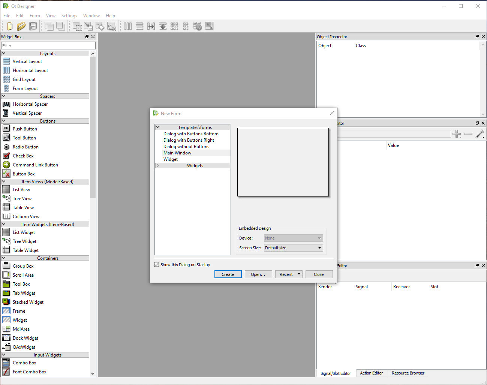

When the program is started, a dialog box appears asking for the type of form to be created. For our application, select **Main Window** and click **Create**.

At the bottom of the window, there is now a window with the name **MainWindow - untitled** as shown below:

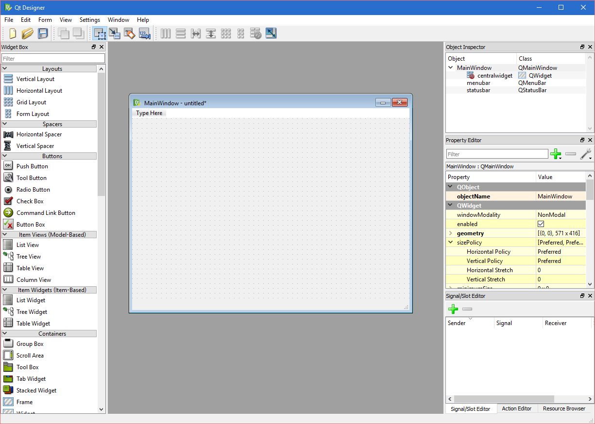

Qt Designer is divided into 5 main views:

 * The widget** Box** on the left of the window shows all available controls we can use to implement the interface.
 * **Design Area** The center of the window is used to select and edit the created controls.
 * **Object Inspector** displays a hierarchical tree of all controls in the application. This tree also corresponds to the object structure that will be created when the description is loaded from Python.
 * **Property Editor** shows the properties of a selected control in the interface. Here, the appearance and other properties of the controls can be set.
 * **Signal / Slot Editor** Handles how the controls are connected. In this worksheet, we will not use this, as these connections will done by our own code.

### Main menu

The first thing to do is create a menu bar for our program. In the menu bar we add features like:

  1. Create New Model - **File / New**
  1. Open Existing Model - **File / Open**
  1. Save Model - **File / Save**
  1. Save the model with another file name - **File / Save as ...**
  1. Exit Program - **File / Exit**
  1. Start a calculation - **Calc / Execute**
 
Menus are created by clicking **Type here** in the main window and entering the name of the main menu. The following example defines the main menu ** File **.
 
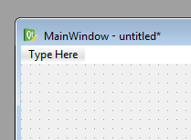

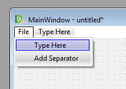

A submenu for a main menu will be created, Qt Designer will automatically create a so-called. Action. These are displayed in **Action Editor** at the bottom right of the window.

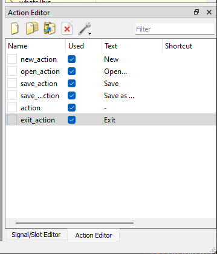

The names of a ** Action ** can be changed by selecting an action in the editor and changing the name in ** Property Editor ** according to the following figure:

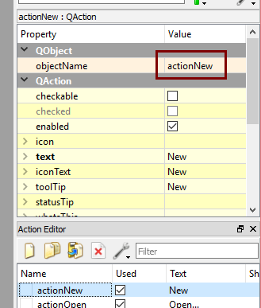

The names given here correspond to the names that will be used in Python. Try to create names without spaces.

Complete the entire menu according to the previous list of menu functions.

### Input controls

In order to edit our model, we need to create controls for this in Qt Designer. The controls can use are **QLineEdit** and **QLabel**. **QLineEdit** is used to enter values in text boxes in the window. **QLabel** we use to give descriptive information on the different controls.

Controls are created by dragging them from the **Widget Box** and releasing them on the form window. The following image shows a number of controls created in this way with associated object names.

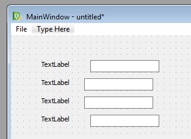

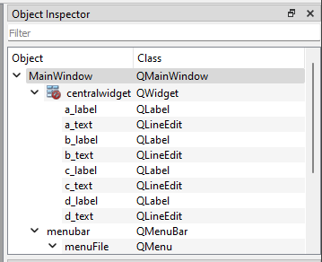

The text for **QLabel** controls is changed by selecting the control and changing the **text** property in **Property Editor** as follows:


!!! note "Tip"

    A good way of naming controls in Qt Designer is to give them a suffix that describes what kind of control it is. For example, a **QLineEdit**-control for the model variable **b** can be given the name **b_edit**. A corresponding **QLabel**-control for the variable could be given the name **b_label**. 

### Buttons for visualisation

To view the visualizations, we also need a set of buttons for this purpose. Create the following buttons (**QPushButton**) to the right of the previous controls (Do not worry about the exact location.):

  * text: **Geometry** - name: ** show_geometry_button **
  * text: **Mesh** - Name: ** show_mesh_button **
  * text: **Nodal values** - name: ** show_nodal_values_button **
  * text: **Element values** - name: ** show_element_values_button **
 
The following figure shows the approximate appearance:
 
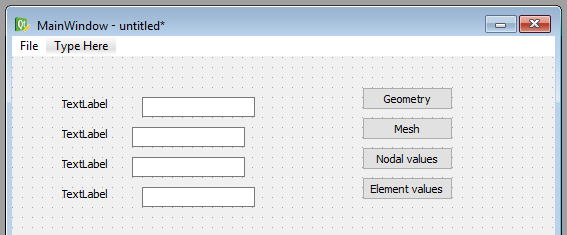

### Text browser for the report output

To view the report we will use a **QPlainTextEdit** control. This check can handle text consisting of multiple rows. Create such a check with the name** report_edit**.

The finished window should now look like in the following figure:

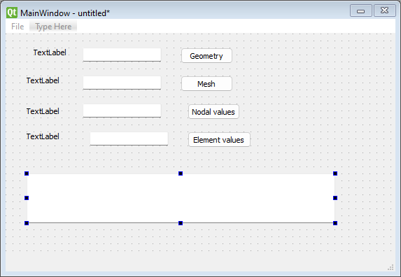

### Organizing controls

Until now, we have placed the controls at approximate locations. To ensure that the controls are placed in a more proper and scalable way, we will use the grid layout and row layout tools.

First, we create a grid layout of labels, text boxes and buttons. Select these controls in Qt Designer:

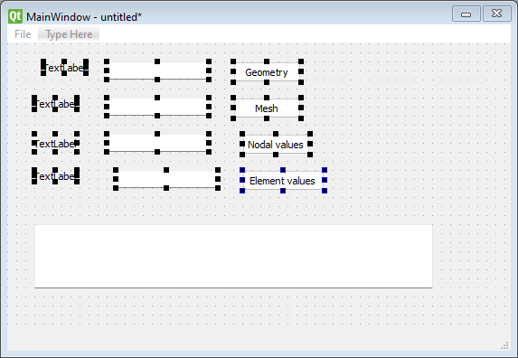

Then click the grid tool:

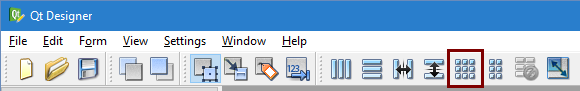

Now, Qt Designer automatically creates a grid layout of the selected controls:

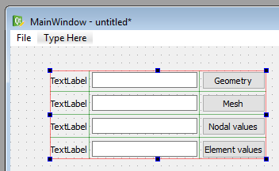

It is a little crowded between the text boxes and the buttons. Insert a "Horizontal Spacer" as shown below:

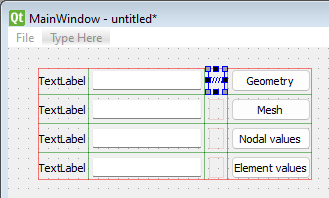

To position the controls to fill out the entire window, select the main window and press **Layout vertically**.

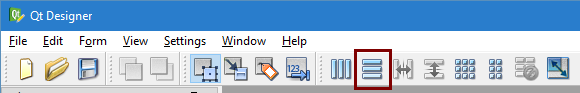

The main window should now look like the following figure:


The object structure should have approximately the following structure and naming (However, it must be adapted to the problem area and own ideas).

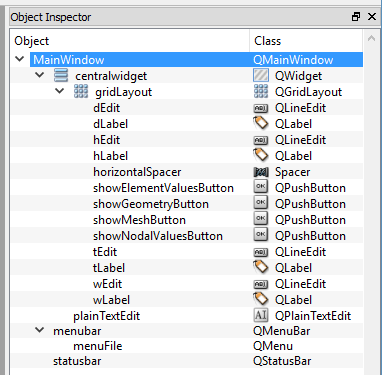

We now have a complete description of the graphical interface. Save the file as **mainwindow.ui**.

## Main program and window class

In order for the program to show our interface, the main application must be modified. Simply, if you create a new Python file, start from the beginning.

### Required modules

To implement the graphical interface, we must import several Python modules.

  * PyQt modules **QtGui** and **QtCore**. These are used to create the boundary.
  * CALFEM modules **calfem.ui**. This contains some special code to integrate our visualization routines and PyQt.
  * Your module for your problem. In this example, we use the **flowmodel** module.
 
The program's import instructions will then be:
 
``` py
# -*- coding: utf-8 -*-

import sys

from qtpy.QtCore import QThread
from qtpy.QtWidgets import QApplication, QDialog, QWidget, QMainWindow, QFileDialog
from qtpy import uic

import flowmodel as fm
```

!!! note "Why qtpy and not PyQt?"

    The reason for using the strange module **qtpy** instead of PyQt is to make the code less dependent on a specific Python Qt-binding. The **qtpy**-module hides this for us and we can use the **PyQt**, **PySide** or **Qt for Python** bindings transparently. 

### Main window class

Our main window is best implemented in a separate class **MainWindow**. The responsibility of this class is to load the interface description and implement the event methods required for the program to work. The most important is an **__init__** method that initializes the class and reads the ui-description as well as shows the window on the screen. The basis for this is shown in the following example:

``` py
class MainWindow(QMainWindow):
    """MainWindow-klass som hanterar vårt huvudfönster"""

    def __init__(self):
        """Constructor"""
        super(QMainWindow, self).__init__()

        # --- Store a reference to the application class
        
        self.app = app
                    
        # --- Load user interface description
        
        uic.loadUi('mainwindow.ui', self)
        
        # --- Show the window
        
        self.show()
        self.raise_()
```

The **uic.loadUi()**-method loads and creates the objects in the ui-file directly in the class. For example, an object, **a_text**, in the ui-file can be accessed directly in the main instance as the class attribute **self.a_text**.         
            
### A new main program

Window-based programs often have a different main program than computational codes. Window-based applications often use an event loop that listens for events from the operating system. The events are sent from the loop to the underlying classes which then handle them.

Our new main program is shown in the following code:

``` py
if __name__ == '__main__':

    # --- Create application instance

    app = QApplication(sys.argv)

    # --- Create and show main window

    widget = MainWindow()
    widget.show()

    # --- Start main event loop

    sys.exit(app.exec_())
```

The **app.exec_()**-method returns when all the application windows have been closed. 

The program we created now has all the code required to display our user  interface on the screen. Under Windows, the interface may look like the following image when the program code is running:

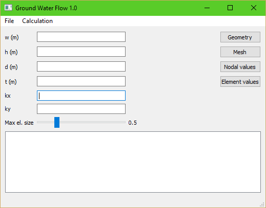

## Connecting methods to events

For the program to run calculations, open and save files, events must be linked from controls to methods in the **MainWindow** class. Connecting events to methods is done using the **.connect(...)**-method that is defined for all events provided by a control.

### Connecting menu events

The first events we need to connect are from the menu. The menu-action in the ui-file are named **new_action** and **open_action**. To create a connection, we first add a method to handle the event itself:

``` py
class MainWindow:
    ...
    def on_new_action(self):
        """Skapa en ny modell"""
        print("on_new_action")
```
            
We leave the implementation of this to the user. The coupling of the method we now do in **__init__(...)**

``` py
class MainWindow:
    ...
    def __init__(self):

        ...
        
        # --- Load user interface from ui-file
        
        uic.loadUi('mainwindow.ui', self)
        
        # --- Connect controls to event methods
        
        self.new_action.triggered.connect(self.on_new_action)
```
            
For menu-action, it is the **triggered** signal that need to be connected.

### Connection signals from buttons

To connect buttons, it is the **clicked** signal that needs to be connected. The following code shows an example of this:

``` py
class MainWindow:
    ...
    def __init__(self, app):
    
        ...
        
        # --- Connect controls to event methods
        
        self.new_action.triggered.connect(self.on_new_action)
        ...
        self.show_geometry_button.clicked.connect(self.on_show_geometry) # <---
        
    ...
    
    def on_show_geometry(self):
        """Visa geometrifönster"""
        
        print("on_show_geometry")
```

## Integrating the computational model

In the previous worksheet, we created our **ModelParams** -, **ModelResults** - and **ModelSolver** - Objects in our main program. In the modified program, it is **MainWindow** that reverts all references to these objects. In order to handle the model and update the controls, the following methods are suitably implemented:

  * **init_model(...)** - Creates the necessary items needed for input, output and resolution of the problem. Also sets default values for the parameters in the model.
  * **update_controls(...)** - Takes values from a **ModelParams** object and assigns the controls to these values.
  * **update_model(...)** - Reads the specified values in the controls and assigns them to the **ModelParams** object.
 
To assign values to controls, the **setText(...)** method is used on the text controls. An example of how this is done is shown in the following code:

``` py
def updateControls(self):
    """Fyll kontrollerna med värden från modellen"""
    
    self.wEdit.setText(str(self.inputData.w))
    ...
```

!!! note "Please note"

    Please note that **self.model_params** stores **float** values and must be converted to character strings before **.setText(...)** is called. This is done in the above example with the ** str(...)** method

To retrieve values from the controls, the **text()** method is used in the text control. An example of how this can be implemented is shown in the following code:

``` py
def update_model(self):
    """Hämta värden från kontroller och uppdatera modellen"""
    
    self.model_params.w = float(self.w_edit.text())
    ...
```

!!! note        

    We have the reverse problem here, ie we have to convert from character string from control to a **float** value by using the **float(...)** function.

## Opening and saving files from disk

The calculation model implemented in Worksheets 2 and 3 includes the **load (...)** and **save(...)**-methods. These methods will be implemented to enable loading and saving a model from a file.

### Open file from disk

To open an already existing file from disk, we must first ask the user about which file to open. This can be done using the function **QFileDialog.getOpenFileName(...)**. The function shows a stanadard file dialog where the user can select an existing file. How it is used is shown in the following example:

``` py
def on_open_action(self):
    """Öppna in indata fil"""
    
    self.filename, _ = QFileDialog.getOpenFileName(self.ui, 
        "Öppna modell", "", "Modell filer (*.json *.jpg *.bmp)")
    
    if self.filename!="":
        ...
```

If the user interrupted the selection of filenames, an empty string is returned. It's always good to always use an if-statemenet to make sure a file is actually selected.

The routine **load(...)** can then be used to load the model from disk with the specified file name.

### Save file to disk

Similarly, if the user wants to save a model to disk, we must first ask the user about a location and a filename. For this purpose, we use the ** QtGui.QFileDialog.getSaveFileName (...) ** function instead. This feature displays a default file dialog asking for a file name and a directory where the file is to be saved. The following code shows how this happens in the ** actionSave **:

``` py
def on_save_action(self):
    """Spara modell"""
    
    self.update_model()
    
    if self.filename == "":
        self.filename, _  = QFileDialog.getSaveFileName(self.ui, 
            "Spara modell", "", "Modell filer (*.json)")
    
    if self.filename!="":
        ... 
```
            
## Executing computational model

The simplest way to execute the calculation is simply to call **solver.execute()** in an event method. However, this has a big drawback. If the calculation model takes a long time to execute, the program will block the event loop and the application can't respond to any events. For a user, it appears that the program locked up, which is not far from the truth.

To solve this, we move the calculation code into a so-called thread. A thread is a parallel execution of a given code. This execution is performed outside of the event loop so it will not block this.

The problem of using threads is that we need to synchronize the execution of these, so that we know when the calculation is complete. This is easily done in PyQt's thread implementation.

To implement our calculation in a thread, we first create a special thread class for our calculation. Add the following code at the top of the module:

``` py
# -*- coding: utf-8 -*-

from qtpy.QtCore import pyqtSlot, pyqtSignal, QThread
from qtpy.QtWidgets import QApplication, QDialog, QWidget, QMainWindow, QFileDialog
from qtpy.uic import loadUi

import calfem.ui as cfui
import flowmodel as fm

class SolverThread(QThread):
    """Klass för att hantera beräkning i bakgrunden"""
    
    def __init__(self, solver, paramStudy = False):
        """Klasskonstruktor"""
        QThread.__init__(self)
        self.solver = solver
        
    def __del__(self):
        self.wait()
        
    def run(self):
        ...

class MainWindow:
    ...
```
        
Under the **run(...)** method, the actual calculation code is called.

To start the calculation when selecting ** Calc / Execute ** in the menu, the event method may look as follows:

``` py
class MainWindow:
    ...
    def onActionExecute(self):
        """Kör beräkningen"""
        
        # --- Disable user interface during calculation     
        
        self.setEnabled(False)
        
        # --- Update model from user interface
        
        self.updateModel()
        
        # --- Create a solver
        
        self.solver = fm.ModelSolver(self.model_params, self.model_results)
        
        # --- Create a thread with the calculation, so that the 
        #     user interface doesn't freeze.
        
        self.solverThread = ModelSolverThread(self.solver)        
        self.solverThread.start()
```
      
This method will then start the computation as a separate thread that does not affect the event loop.

To know when the calculation thread ends, we connect a method to the signal **finished** on our thread class. First we create the **on_mode_solver_finished (...)**-method:

``` py
class MainWindow:
    ...
    def onModelSolverFinished(self):
        """Anropas när beräkningstråden avslutas"""
        
        # --- Activate user interface       
        
        self.setEnabled(True)
        
        # --- Generate result report        

        ...
```
            
The method is then connected to the thread object with **connect(...)** in approximately the same as for the controls:

``` py
class MainWindow:
    ...
    def on_execute_action(self):
    
        ...
                    
        self.solver_thread = ModelSolverThread(self.solver)
        self.solver_thread.finished.connect(self.on_model_solver_finished)   
        self.solver_thread.start()
```
                        
When the calculation ends, the thread object will automatically invoke the **self.on_model_solver_finished()** method.

## Updating the **ModelVisualisation** class

In the previous worksheet 3, visualization was implemented in the class **ModelVisualization**. We will now expand the class of methods to selectively call the different visualization variants and link them to event methods in our **MainWindow** class.

To get some better control over the visualization windows to be displayed, a method for each visualization type is implemented. For example:

  * **show_geometry()** - Displays the geometry definition for the problem.
  * **show_mesh()** - Displays the computation network generated with GMSH.
  * **show_nodalValues()** - Shows calculated nodes.
  * **show_elementValues()** - Shows calculated element values.
  
  For the visualization class to keep track of which windows are open, 4 class variables are created to store references to the displayed figures.

``` py
class Visualisation(object):
    """Klass för visualisering av resulat"""

    def __init__(self, model_params, model_results):
        """Konstruktor"""
        
        self.model_params = model_params
        self.model_results = model_results
        
        # --- Variables for storing referencese to figures.
        
        self.geom_fig = None
        self.mesh_fig = None
        self.el_value_fig = None
        self.node_value_fig = None
```
            
We set the variables to **None** so that we can distinguish them from the assigned variables.

Ett exempel på hur detta kan användas visas i följande metod:

``` py
class ModelVisualisation:
    ...
    def show_geometry(self):
        """Visa geometri visualisering"""
        
        geometry = self.model_results.geometry
        
        self.geom_fig = cfv.figure(self.geom_fig)
        cfv.clf()            
        cfv.draw_geometry(geometry, title="Geometry")
```

The **cfv.figure(...)** function takes an existing figure reference as input. Depending on whether it is assigned or not created, it returns the existing one or automatically creates a new figure. **clf()** clears the contents of the image window.

 The **ModelVisualisation**-class should also implement a method **close_all(...)** that closes all open windows and resets the character variables.

## Submission and reporting

What to do in this worksheet is:

 * Implement _all_ event methods for the controls used in the interface.
 * Implement basic features like new model, save model, save as and exit program.
 * Implement controls to ensure that visualization methods are not called if a calculation is not performed. Use a flag **self.calc_done** to enter the calculation status.
 * Complete the implementation of the ** Visualization ** class so it can handle all visualization cases. Re-create the object of this class after each completed calculation. Create an empty variable ** MainWindow ** constructor, so if-rates can be used to test if there is a current instance for ** Visualization **
 * After the calculation, **report_edit** - the control will be assigned output from the ** Report ** class. **report_edit** has a method **setPlainText(...)** just for this purpose. Current content in the control can be cleared using the **clear()** method.
 * At this point, the program should be a complete calculation applications.

The submission must consist of a zip file (or another archive format) consisting of:

 * All Python files. (.py files)
 * An example of a saved json file.