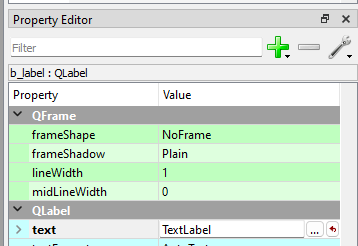
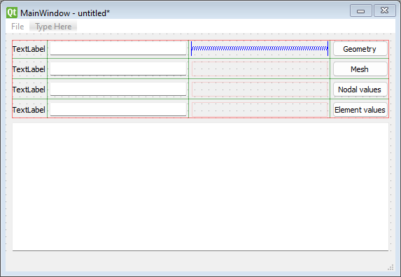

# Program for Technical Applications - Worksheet 4

 ** Remember: ** When ** ... ** appears in the program examples, this indicates that there is no code that you yourself have to add. Variables and data structures are just examples. Depending on the type of problem you may need other data structures than those described in the code examples.

## General

This worksheet contains the following tasks:

  1. Create interface in Qt Designer.
  1. Create a master program and class for graphical interfaces.
  1. Create a thread class to handle calculations in the background.
  1. Update the visualization class to display single windows, and to close all opened windows.
 
## Graphical User Interface in Qt Designer
 
The graphical interface is created in the Qt Designer software. This program creates a description of the interface in XML that will be read by our program.

Qt Designer can be started directly from Spyder by clicking ** Tools / External tools / Qt Designer ** in the menu. The program looks like in the following figure:

When the program is started, a dialog box appears to select the type of form to be created. For our main window, select ** Main Window ** and click ** Create **.

At the bottom of the window there is now a window with the name ** MainWindow - untitled ** as shown below:

Qt Designer is divided into 5 main views:

  * ** Widget Box ** on the left of the window shows all available controls we can use to design the interface.
  * ** Design Area ** The center of the window is used to select and edit the created controls.
  * ** Object Inspector ** displays a hierarchical tree of all controls in the project. This tree also corresponds to the object structure that will be created when the description is loaded into the Python code.
  * ** Property Editor ** shows the properties of a selected control in the interface. Here, the appearance and other features of the controls can be controlled.
  * ** Signal / Slot Editor ** Handles how the controls are purely incidentally linked. In this task, we will not use this, as this connection will be made in our Python Code.

### Main menu

The first thing to do is create a menu bar for our program. In the menu bar we add features like:

  1. Create New Model - ** File / New **
  1. Open Existing Model - ** File / Open **
  1. Save Model - ** File / Save **
  1. Save the model with another file name - ** File / Save as ... **
  1. Exit Program - ** File / Exit **
  1. Start a calculation - ** Calc / Execute **
 
Menus are created by clicking ** Type here ** in the main window and enter the name of the main menu. The following example defines the main menu ** File **.
 

A submenu for a main menu will be created, Qt Designer will automatically create a so-called. Action. These are displayed in ** Action Editor ** at the bottom right of the window.

The names of a ** Action ** can be changed by selecting an action in the editor and changing the name in ** Property Editor ** according to the following figure:

The names given here correspond to the names that will be used in Python. Try to create names without spaces.

Complete the entire menu according to the previous list of menu functions.

### Input controls

In order to edit our model, we need to create controls for this in Qt Designer. The controls can use are ** QLineEdit ** and ** QLabel **. QLineEdit is used to enter values in text boxes on the screen. QLabel we use to describe what the text boxes describe for parameter.

Controls are created by dragging the control from ** Widget Box ** and releasing them on the form window. The following image shows a number of controls created in this way with associated object names.

The text for ** QLabel ** controls is changed by selecting the control and changing the ** text ** property in ** Property Editor ** as follows:

### Buttons for visualisation

To view the visualizations, we also need a number of buttons for this. Create the following buttons (** QPushButton **) to the right of the previous controls (Do not worry about exact location.) Approximate location.):

  * text: ** Geometry ** - name: ** showGeometryButton **
  * text: ** Mesh ** - Name: ** showMeshButton **
  * text: ** Nodal values ** - name: ** showNodalValuesButton **
  * text: ** Element values ** - name: ** showElementValuesButton **
 
The following figure shows approximate appearance:
 

### Text browser for the report output

To view the report we will use a ** QPlainTextEdit ** control. This check can handle text consisting of multiple rows. Create such a check with the name ** reportEdit **.

The finished window should now look like in the following figure:

### Organizing controls

Until now, we have placed the controls approximately. To ensure that the controls are placed in a more proper and scalable way, we will use the grid layout and row layout tool.

First, we create a grid layout of labels, text boxes and buttons. Select these controls in Qt Designer:

Then click the grid tool:

Now, Qt Designer automatically creates a grid layout of the selected controls:

It is a little crowded between the text boxes and the buttons. Insert a "Horizontal Spacer" as shown below:

To position the controls to fill out the entire window, select the main window and press ** Layout vertically **.

The main window should now look like in the following image:

The object structure should have the following structure and naming (However, it must be adapted to the problem area and own ideas).

We now have a complete description of the graphical interface. Save the file as "mainwindow.ui".

## Huvudprogram och klass för huvudfönster

In order for the program to show our interface, the main application must be modified. Simply, if you create a new Python file, start from the beginning.

### Moduler som behöver importeras

To implement the graphical interface, we must import a number of Python modules.

  * PyQT modules ** QtGui ** and ** QtCore **. These are used to create the boundary.
  * CALFEM modules ** calfem.ui **. This contains some special code to integrate our visualization routines and PyQt.
  * Is your own module for your problem area. In this example, we use the ** flow model ** module.
 
The program's import instructions will then be:
 
    # -*- coding: utf-8 -*-

    import sys

    from PyQt5.QtCore import pyqtSlot, pyqtSignal, QThread
    from PyQt5.QtWidgets import QApplication, QDialog, QWidget, QMainWindow, QFileDialog
    from PyQt5.uic import loadUi

    import flowmodel as fm
    
### Main window class

Our main window is most easily implemented in a separate class ** MainWindow **. The task of the class is to load the interface description and implement the event methods required for the program to work. The most basic is a ** __ init __ ** method that initiates the class and reads the description as well as displays the window on the screen. The basis for this is shown in the following example:

    class MainWindow(QMainWindow):
        """MainWindow-klass som hanterar vårt huvudfönster"""

        def __init__(self):
            """Constructor"""
            super(QMainWindow, self).__init__()

            # --- Lagra en referens till applikationsinstansen i klassen
            
            self.app = app
                        
            # --- Läs in gränssnitt från fil
            
            self.ui = loadUi('mainwindow.ui', self)
            
            # --- Se till att visa fönstret
            
            self.ui.show()
            self.ui.raise_()
            
** self.ui ** will be the base of our object tree. It is in this variable all controls are defined.         
            
### A new main program

Programs that use windows often have a different main program than, for example, calculation programs. A window-based application often uses a so-called Event loop that awaits events from the operating system. The events send the loop to the underlying classes which then handle them.

Our new main program is shown in the following code:

    if __name__ == '__main__':

        # --- Skapa applikationsinstans

        app = QApplication(sys.argv)

        # --- Skapa och visa huvudfönster

        widget = MainWindow()
        widget.show()

        # --- Starta händelseloopen

        sys.exit(app.exec_())

Metoden **app.exec_()** returnerar när alla programmets fönster har stängts. 

The program we created now has all the code required to display our graphical interface on the screen. Under Windows, the interface may look like the following image when the program code is running:

## Connecting methods to events

In order for the program to run calculations, open and save files, we must link events from controls to methods in the ** MainWindow ** class. Linking events for checks to methods is done using the **. Connect (...) ** method that is defined for all events a control can handle.

### Connecting menu events

The first events we associate are menu events. The menu events in the ui file were named with ** actionNew ** and ** actionOpen **. To create a link, we first add a method to handle the event itself:

    class MainWindow:
        ...
        def onActionNew(self):
            """Skapa en ny modell"""
            print("onActionNew")
            
We leave the implementation of this to the user. The coupling of the method we now do in ** __ init __ (...) **

    class MainWindow:
        ...
        def __init__(self):

            ...
            
            # --- Läs in gränssnitt från fil
            
            self.ui = loadUi('mainwindow.ui', self)
            
            # --- Koppla kontroller till händelsemetoder
            
            self.ui.actionNew.triggered.connect(self.onActionNew)
            
For menu events, it is ** triggered ** to be connected.

### Koppling av händelser för knappar

To connect buttons, it is the ** clicked ** event to be connected. The following code shows an example of this:

    class MainWindow:
        ...
        def __init__(self, app):
        
            ...
            
            # --- Koppla kontroller till händelsemetoder
            
            self.ui.actionNew.triggered.connect(self.onActionNew)
            ...
            self.ui.showGeometryButton.clicked.connect(self.onShowGeometry) # <---
            
        ...
        
        def onShowGeometry(self):
            """Visa geometrifönster"""
            
            print("onShowGeometry")

## Integrating the computational model

In the previous worksheet, we created our ** InputData ** -, ** OutputData ** - and ** Solver ** - Objects in our main program. In the modified program, it is ** MainWindow ** that reverts all references to these objects. In order to handle the model and update the controls, the following methods are suitably implemented:

  * ** initModel (...) ** - Creates the necessary items needed for input, output and resolution of the problem. Also sets default values for the parameters in the model.
  * ** updateControls (...) ** - Takes values from a ** InputData ** object and assigns the controls to these values.
  * ** updateModel (...) ** - Reads the specified values in the controls and assigns them to the ** InputData ** object.
 
To assign values to controls, the ** setText (...) ** method is used on the text controls. An example of how this is done is shown in the following code:

    def updateControls(self):
        """Fyll kontrollerna med värden från modellen"""
        
        self.ui.wEdit.setText(str(self.inputData.w))
        ...

> Please note that ** self.inputData ** stores ** float ** values and must be converted to character strings before ** setText (...) ** is called. This is done in the above example with the ** str (...) ** method

To retrieve values from the controls, the ** text () ** method is used in the text control. An example of how this can be implemented is shown in the following code:

    def updateModel(self):
        """Hämta värden från kontroller och uppdatera modellen"""
        
        self.inputData.w = float(self.ui.wEdit.text())
        ...
        
> We have the reverse problem here, ie we have to convert from character string from control to a ** float ** value by using the ** float (...) ** function.

## Opening and saving files from disk

The calculation model implemented in Worksheets 2 and 3 includes the ** load (...) ** and ** save (...) ** methods. Disse vil nu bli brukt til at implementere metoder for å åpne og lagre våre modeller til disk.

### Open file from disk

To open an already existing file from disk, we must first ask the user about which file to open. This can be done with the function ** QFileDialog.getOpenFileName (...) **. The function shows a stanadard file dialog where the user can select an existing file. How it is used is shown in the following example:

    def onActionOpen(self):
        """Öppna in indata fil"""
        
        self.filename, _ = QFileDialog.getOpenFileName(self.ui, 
            "Öppna modell", "", "Modell filer (*.json *.jpg *.bmp)")
        
        if self.filename!="":
            ...
If the user interrupted the selection of filenames, an empty string is returned. It's always good to always use an if-rate to make sure a file is actually selected.

The routine ** load (...) ** can then be used to load the model from disk with the specified file name.

### Save file to disk

Similarly, if the user wants to save a model to disk, we must first ask the user about a location and a filename. For this purpose, we use the ** QtGui.QFileDialog.getSaveFileName (...) ** function instead. This feature displays a default file dialog asking for a file name and a directory where the file is to be saved. The following code shows how this happens in the ** actionSave **:

    def onActionSave(self):
        """Spara modell"""
        
        self.updateModel()
        
        if self.filename == "":
            self.filename, _  = QFileDialog.getSaveFileName(self.ui, 
                "Spara modell", "", "Modell filer (*.json)")
        
        if self.filename!="":
            ... 
            
## Executing computational model

The simplest model to execute the calculation model is simply to call ** solver.execute () ** in an event method. However, this has a big problem. If the calculation model takes a long time to execute, the program will remain in the event mode and the event loop will not be able to be recovered before the method ends. For a user, it appears that the program locked, which is not far from the truth.

To solve this problem, we put the calculation code into a so-called wire. A thread is a parallel execution of a given code. This execution is outside of the event loop so it will not block this.

The problem of using threads is that we need to synchronize the execution of these,
So that we know when the calculation is complete. However, this is easily done in PyQt's thread implementation.

To implement our calculation in a thread, we must first create a special thread class for our calculation. Add the following code at the top of the module:

    # -*- coding: utf-8 -*-

    from PyQt5.QtCore import pyqtSlot, pyqtSignal, QThread
    from PyQt5.QtWidgets import QApplication, QDialog, QWidget, QMainWindow, QFileDialog
    from PyQt5.uic import loadUi

    import calfem.ui as cfui
    import flowmodel as fm

    class SolverThread(QThread):
        """Klass för att hantera beräkning i bakgrunden"""
        
        def __init__(self, solver, paramStudy = False):
            """Klasskonstruktor"""
            QThread.__init__(self)
            self.solver = solver
            
        def __del__(self):
            self.wait()
            
        def run(self):
            ...

    class MainWindow:
        ...
        
Under the ** run (...) ** method, the actual call is added to start the calculation.

To start the calculation when selecting ** Calc / Execute ** in the menu, the event method may look as follows:

    class MainWindow:
        ...
        def onActionExecute(self):
            """Kör beräkningen"""
            
            # --- Avaktivera gränssnitt under beräkningen.        
            
            self.ui.setEnabled(False)
            
            # --- Uppdatera värden från kontroller
            
            self.updateModel()
            
            # --- Skapa en lösare
            
            self.solver = fm.Solver(self.inputData, self.outputData)
            
            # --- Starta en tråd för att köra beräkningen, så att 
            #     gränssnittet inte fryser.
            
            self.solverThread = SolverThread(self.solver)        
            self.solverThread.start()
      
This method will then start the looser as a separate thread that does not affect the event loop.

To know when the calculation thread ends, connect a method to event ** finished ** on our thread class. We first create the ** ** onSolverFinished method (...) **:

    class MainWindow:
        ...
        def onSolverFinished(self):
            """Anropas när beräkningstråden avslutas"""
            
            # --- Aktivera gränssnitt igen        
            
            self.ui.setEnabled(True)
            
            # --- Generera resulatrapport.        

            ...
            
The method is then connected to the thread object with ** connect (...) ** approximately the same as for the controls:

    class MainWindow:
        ...
        def onActionExecute(self):
        
            ...
                        
            self.solverThread = SolverThread(self.solver)
            self.solverThread.finished.connect(self.onSolverFinished)   
            self.solverThread.start()
                        
When the calculation ends, the thread object will automatically invoke the ** self.onSolverFinished ** method.

## Updating the **Visualisation** class

In the previous worksheet 3, visualization was implemented in the class ** Visualization **. We will now expand the class of methods to selectively call the different visualization variants and link them to event methods in our ** MainWindow ** class.

To get some better control over the visualization windows to be displayed, a method for each visualization type is implemented. For example:

  * ** showGeometry () ** - Displays the geometry definition for the problem.
  * ** showMesh () ** - Displays the computation network generated with GMSH.
  * ** showNodalValues () ** - Shows calculated nodes.
  * ** showElementValues () ** - Shows calculated element values.
 
In order for the visualization class to keep track of which windows are open, 4 class variables are created to store references to the displayed figures.

    class Visualisation(object):
        """Klass för visualisering av resulat"""

        def __init__(self, inputData, outputData):
            """Konstruktor"""
            
            self.inputData = inputData
            self.outputData = outputData
            
            # --- Variabler som lagrar referenser till öppnade figurer
            
            self.geomFig = None
            self.meshFig = None
            self.elValueFig = None
            self.nodeValueFig = None
            
We set the variables to ** None ** so that we can distinguish them from assigned variables.

Ett exempel på hur detta kan användas visas i följande metod:

    class Visualisation(object):
        ...
        def showGeometry(self):
            """Visa geometri visualisering"""
            
            geometry = self.outputData.geometry
            
            self.geomFig = cfv.figure(self.geomFig)
            cfv.clf()            
            cfv.drawGeometry(geometry, title="Geometry")

The ** cfv.figure (...) ** function takes an existing figure reference as input. Depending on whether it is assigned or not created, it returns the existing one or automatically creates a new figure. ** clf () ** clears the contents of the image window.

** Visualization ** - The class should also implement a method ** closeAll (...) ** that closes all open windows and resets the character variables.

## Submission and reporting

What to do in this worksheet is:

 * Implement _alla_ event methods for the controls used in the interface.
 * Implement basic features like new model, save model, save as and exit program.
 * Implement controls to ensure that visualization methods are not called if a calculation is not performed. Use a flag ** self.calcDone ** to enter the calculation status.
 * Complete the implementation of the ** Visualization ** class so it can handle all visualization cases. Re-create the object of this class after each completed calculation. Create an empty variable ** MainWindow ** constructor, so if-rates can be used to test if there is a current instance for ** Visualization **
 * After the calculation, ** reportEdit ** - the control will be assigned output from the ** Report ** class. ** reportEdit ** has a method ** setPlainText (...) ** just for this purpose. Current content in the control can be cleared using the ** clear () ** method.
 * At this work sheet, the program should be a complete independent calculation program.

The submission must consist of a zip file (or other archive format) consisting of:

 * All Python files. (.py files)
 * An example of a saved json file.