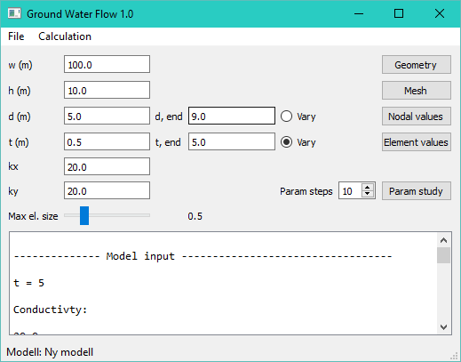
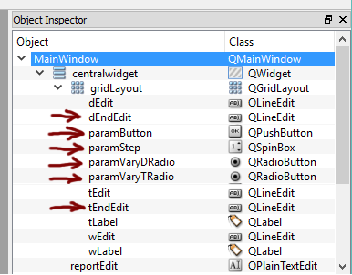

# Programutveckling för Tekniska Tillämpningar - Arbetsblad 5

## Allmänt

I detta arbetsblad innehåller följande moment:

 1. Utöka gränssnittet med kontroller för att kunna göra parameterstudier.
 1. Lägga till input-parametrar i InputData-klassen för att kunna hantera parameterstudierna.
 1. Implementera en rutin i Solver-klassen för att hantera parameterstudier.
 1. Implementera en rutin för att exportera resultaten från en körning till en Visualisation Toolkit (.vtk) fil med hjälp av pyvtk.
 
## Kontroller för parameterstudier

Välj ut 2 av parametrarna i gränsnittet och lägg till kontroller för att kunna välja startvärde, slutvärde, antal steg som skall simuleras.

Följande bild visar ett exempel på hur detta kan se ut:

Följande kontroller och tillhörande namn har lagts till:

Sätt bra standard värden på alla kontroller, så att det går att utföra en beräkning utan behöva fylla i alla värden.

Koppla en händelsemetod, **onExecuteParamStudy** till **Param study**-knappen. För att kunna hantera parameterstudier i vår modell måste vi lägga till ett antal extra inparametrar i vår **InputData**-klass:

 * **paramD** - Flagga som anger om parametern d skall varieras.
 * **paramT** - Flagga som anger om parametern t skall varieras.
 * **dStart** - Startvärde på d.
 * **dEnd** - Slutvärde på d.
 * **tStart** - Startvärde på t.
 * **tEnd** - Slutvärde på t.
 * **paramFilename** - Variabel som bestämmer hur filnamnen skall namnges.
 * **paramSteps** - Variable som anger antalet steg i studein.
 
 
 **onExecuteParamStudy** skall ha ungefär ha samma struktur som **onActionExecute**. I början av metoden lägger vi till tilldelning av de nya parametrarna utifrån de nya kontrollerna. Följande kod visar hur detta kan se ut: 

    def onExecuteParamStudy(self):
        """Exekvera parameterstudie"""

        # --- Hämta värden från grafiskt gränssnitt.
        
        self.inputData.paramD = self.ui.paramVaryDRadio.isChecked()
        self.inputData.paramT = self.ui.paramVaryTRadio.isChecked()
        
        if self.inputData.paramD:
            self.inputData.dStart = float(self.ui.dEdit.text())
            self.inputData.dEnd = float(self.ui.dEndEdit.text())
        elif self.inputData.paramT:
            self.inputData.tStart = float(self.ui.tEdit.text())
            self.inputData.tEnd = float(self.ui.tEndEdit.text())

        self.inputData.paramFilename = "paramStudy"
        self.inputData.paramSteps = int(self.ui.paramStep.value())
 
## Uppdatera Solver-klassen för att hantera parameterstudier

I **Solver**-klassen måste vi nu lägga till en rutin, **executeParamStudy(...)**, som implementerar mekaniken att exekvera parameterstudien.

    def executeParamStudy(self):
        """Kör parameter studie"""
        
        # -- Lagra tidigare värden på d
        
        old_d = self.inputData.d
        old_t = self.inputData.t
        
        i = 1
        
        if self.inputData.paramD:
        
            # --- Skapa värden att simulera över
        
            dRange = np.linspace(self.inputData.dStart, self.inputData.dEnd,
                self.inputData.paramSteps)
                
            # --- Starta parameterstudien
                
            for d in dRange:
                print("Executing for d = %g..." % d)
                
                # --- Sätt önskad parameter i InputData-instansen
                ...
                # --- Kör beräkningen 
                ...
                # --- Exportera vtk-fil
                ...
                
        elif self.inputData.paramT:
            ...
                
        # --- Återställ ursprungsvärden
        
        self.inputData.d = old_d
        self.inputData.t = old_t
        
## Export av resultat till VTK-filer

I detta arbetsblad kommer vi att exportera resultaten och visa dessa i ett etablerat visualiseringsverktyg, ParaView. ParaView använder sig av ett speciellt standardiserat filformat där filerna har ändelsen .vtk. För att skapa dessa filer skall vi använda ett speciellt Python-bibliotek, **pyvtk**, detta bibliotek gör det enkelt att på en hög nivå skapa dessa filer.

Först lägger vi till import-direktivet längst upp i vår modul:

    import pyvtk as vtk

I nästa steg skall vi skapa en metod i **Solver**-klassen, **exportVtk(...)** för att utföra själa exporten.

**pyvtk** har en mängd datatyper. Vi kommer att utgå från primitiven **vtk.PolyData**. Denna datatype lämpar sig bra till att hantera ostrukturerade element som vi har i denna tillämpning. För att definiera uppritning av denna datatyp behövs punkter och topologi. Av en händelse har vi detta som ett resultat av beräkningen. **pyvtk** hanterar dock inte NumPy-arrayer, så vi får göra lite tricks för att konvertera dessa till rätt format:

    def exportVtk(self, filename):
        """Export results to VTK"""        
        
        print("Exporting results to %s." % filename)
        
        # --- Skapa punkter och polygon definitioner från vårt nät
        
        points = self.outputData.coords.tolist()
        
        # --- Tänk på att topologin i VTK är 0-baserad varför vi måste minskar **edof** med 1.
        
        polygons = (self.outputData.edof-1).tolist()
        
        # --- För spänningsproblemet användas, se också nästa stycke:
        
        # polygons = (self.outputData.topo-1).tolist()
                
        # --- Resultat från beräkningen skapas i separata objekt. Punkter i vtk.PointData och
        # --- elementdata i vtk.CellData. Nedan anger vi både vektor data och skalärvärden för elementen.
        # --- Tänk på att vektorerna måste ha 3 komponenter, så lägg till detta i beräkningsdelen.
        
        pointData = vtk.PointData(vtk.Scalars(self.outputData.a.tolist(), name="pressure"))
        cellData = vtk.CellData(vtk.Scalars(self.outputData.maxFlow, name="maxflow"), vtk.Vectors(self.outputData.flow, "flow"))
        
        # --- För spänningsproblemet blir det istället (ingen pointData)
        
        # cellData = vtk.CellData(vtk.Scalars(self.outputData.mises, name="mises"), vtk.Vectors(self.outputData.stress1, "principal stress 1"), vtk.Vectors(self.outputData.stress2, "principal stress 2"))        
        
        # --- Skapa strukturen för elementnätet.
        
        structure = vtk.PolyData(points = points, polygons = polygons)
        
        # --- Lagra allting i en vtk.VtkData instans
        
        vtkData = vtk.VtkData(structure, pointData, cellData)
        
        # --- För spänningsfallet
        
        # vtkData = vtk.VtkData(structure, cellData)        
        
        # --- Spara allt till filen
        
        vtkData.tofile(filename, "ascii")
        
ParaView kan automatiskt hantera resultaten från parameterstudien om filerna namnges **paramStudy_01.vtk**, **paramStudy_02.vtk**. Filen kan öppnas som en fil **paramStudy** i programmet.        

## Uppdatering av **Solver**-klassen för spänningsproblemet

För att spänningsproblement skall fungera måste vi lagra ytterligare en variabel i **OutputData**-klassen:

    def execute(self):
        """Metod för att utföra finita element beräkningen."""
        
        # --- Överför modell variabler till lokala referenser

        ...        
        
        # --- Nätgenerering
        
        elType = 3
        dofsPerNode= 1 
        geometry = self.inputData.geometry()        
        
        meshGen = cfm.GmshMeshGenerator(geometry)
        meshGen.elSizeFactor = elSizeFactor     # Factor that changes element sizes.
        meshGen.elType = elType
        meshGen.dofsPerNode = dofsPerNode
        
        coords, edof, dofs, bdofs, elementmarkers = meshGen.create()
        self.outputdata.topo = meshGen.topo
        
Topo innehåller nodtopologin, som kan användas med vtk.

## Uppdatering av SolverThread-klassen

För att kunna köra en parameterstudie måste vi anropa den tidigare definierade metode **executeParamStudy(...)** istället för **execute(...)**. Detta gör vi genom att definiera en ytterligare metod-variabler **self.paramStudy** som anger om en parameterstudie skall köras eller en enstaka beräkning. Koden för att starta en parameterstudie visas nedan. Notera den extra parametern i **SolverThread**:s konstruktur.

    def onExecuteParamStudy(self):
        """Exekvera parameterstudie"""
        
        ...

        # --- Starta en tråd för att köra beräkningen, så att 
        #     gränssnittet inte fryser.
        
        self.solverThread = SolverThread(self.solver, paramStudy = True)        
        self.solverThread.finished.connect(self.onSolverFinished)        
        self.solverThread.start()

## Inlämning och redovisning

Det som skall göras i detta arbetsblad är:

 * Implementera gränssnittskontroller och knappar för parameterstudiefunktionaliteten
 * Uppdatera **Solver**-klassen att hantera parameterstudier.
 * Implementera funktionen **exportVtk(...)** i **Solver**-klassen.
 * Metoden **excuteParamStudy(...)** skall för varje beräkning skriva ut en vtk-fil men samma filnamn som modellen. Dvs [filnamn]_01.vtk, [filnamn]_02.vtk.
 * Importera vtk-filerna i ParaView för visualisering. 
  
Inlämningen skall bestå av en zip-fil (eller annat arkivformat) bestående av: 

 * Alla Python-filer. (.py-filer)
 * Bilder från ParaView-visualiseringar.