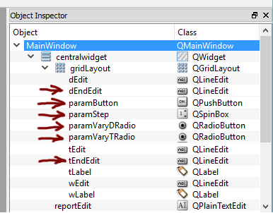

# Program for Technical Applications - Worksheet 5

## General

This worksheet contains the following tasks:

 1. Add user interface controls for performing parameter studies
 1. Add input variables in the InputData-class for managing parameter studies.
 1. Implement a routine in the Solver-class to perform parameter studies.
 1. Implement a routine to export the results from a parameter study to ParaView using pyvtk.
 
## User interface controls for the parameter study

Select 2 of the parameters in the interface and add controls to be able to select the start value, end value, number of steps to be simulated.

The following picture shows an example of how this can be done:

The following controls and associated names have been added:

Set good default values on all controls so that one can perform a calculation without having to fill in all values.

Connect an event method, **on_execute_param_study** to the **Param study** button. In order to handle parameter studies in our model, we must add a number of extra variables in our **ModelPArams** class:

 * **param_d** - Flag indicating whether parameter d should be varied.
 * **param_t** - Flag indicating whether the parameter t should be varied.
 * **d_start** - Starting value of d.
 * **d_end** - Ending value of d.
 * **t_start** - Start value of t.
 * **t_end** - Ending value of t.
 * **param_filename** - Variable controling how filenas should be formatted.
 * **param_steps** - Variable controlling the number of steps in the parameter study.
 
 
**on_execute_param_study** should have approximately the same structure as **onActionExecute**. At the beginning of the method, we add assigment of the new parameters based on the new controls. The following code illustrates this:

    def on_execute_param_study(self):
        """Exekvera parameterstudie"""

        # --- Hämta värden från grafiskt gränssnitt.
        
        self.model_params.param_d = self.param_vary_d_radio.isChecked()
        self.model_params.param_t = self.param_vary_t_radio.isChecked()
        
        if self.model_params.param_d:
            self.model_params.d_start = float(self.d_edit.text())
            self.model_params.d_end = float(self.d_end_edit.text())
        elif self.model_params.paramT:
            self.model_params.t_start = float(self.t_edit.text())
            self.model_params.t_end = float(self.t_end_edit.text())

        self.model_params.param_filename = "param_study"
        self.model_params.param_steps = int(self.param_step.value())
 
## Update the Solver-class to handle parameter studies

In the **Solver** class, we now add a routine, **execute_paramStudy(...)**, which implements the mechanics to execute the parameter study.

    def execute_paramStudy(self):
        """Kör parameter studie"""
        
        # -- Lagra tidigare värden på d
        
        old_d = self.model_params.d
        old_t = self.model_params.t
        
        i = 1
        
        if self.model_params.param_d:
        
            # --- Skapa värden att simulera över
        
            dRange = np.linspace(self.model_params.d_start, self.model_params.d_end,
                self.model_params.paramSteps)
                
            # --- Starta parameterstudien
                
            for d in d_range:
                print("Executing for d = %g..." % d)
                
                # --- Sätt önskad parameter i InputData-instansen
                ...
                # --- Kör beräkningen 
                ...
                # --- Exportera vtk-fil
                ...
                
        elif self.model_params.param_t:
            ...
                
        # --- Återställ ursprungsvärden
        
        self.model_params.d = old_d
        self.model_params.t = old_t
        
## Exporting results to VTK-files

In this worksheet, we will export the results and display them in the visualization software, ParaView. ParaView uses standardized file format with the extension .vtk. To create these files, we will use a special Python library, **pyvtk**, this library makes it easy to create these files.

First, we add the import directive at the top of our module:

    import pyvtk as vtk

In the next step, we will add a method in the **ModelSolver**-class, **export_vtk(...)** to perform the actual export.

**pyvtk** has a lot of data types. We will start from the primitive **vtk.PolyData**. This data type is well suited to managing unstructured elements that we have in this application. To be able to visualise this type of data, points and topology are needed. This information is available from the calculations. However, **pyvtk** does not handle NumPy arrays, so we have to do some tricks to convert these into the right format:

    def export_vtk(self, filename):
        """Export results to VTK"""        
        
        print("Exporting results to %s." % filename)
        
        # --- Skapa punkter och polygon definitioner från vårt nät
        
        points = self.model_results.coords.tolist()
        
        # --- Tänk på att topologin i VTK är 0-baserad varför vi måste minskar **edof** med 1.
        
        polygons = (self.model_results.edof-1).tolist()
        
        # --- För spänningsproblemet användas, se också nästa stycke:
        
        # polygons = (self.model_results.topo-1).tolist()
                
        # --- Resultat från beräkningen skapas i separata objekt. Punkter i vtk.PointData och
        # --- elementdata i vtk.CellData. Nedan anger vi både vektor data och skalärvärden för elementen.
        # --- Tänk på att vektorerna måste ha 3 komponenter, så lägg till detta i beräkningsdelen.
        
        pointData = vtk.PointData(vtk.Scalars(self.model_results.a.tolist(), name="pressure"))
        cellData = vtk.CellData(vtk.Scalars(self.model_results.maxFlow, name="maxflow"), vtk.Vectors(self.model_results.flow, "flow"))
        
        # --- För spänningsproblemet blir det istället (ingen pointData)
        
        # cellData = vtk.CellData(vtk.Scalars(self.model_results.mises, name="mises"), vtk.Vectors(self.model_results.stress1, "principal stress 1"), vtk.Vectors(self.model_results.stress2, "principal stress 2"))        
        
        # --- Skapa strukturen för elementnätet.
        
        structure = vtk.PolyData(points = points, polygons = polygons)
        
        # --- Lagra allting i en vtk.VtkData instans
        
        vtkData = vtk.VtkData(structure, pointData, cellData)
        
        # --- För spänningsfallet
        
        # vtkData = vtk.VtkData(structure, cellData)        
        
        # --- Spara allt till filen
        
        vtkData.tofile(filename, "ascii")
        
ParaView can automatically manage the results of the parameter study if the files are named **param_study_01.vtk**, **param_study_02.vtk**. The file can be opened as a file **param_study** in the application.

## Updating the **ModelSolver**-class for the stress problem

In order for stress problem to work, we must store another variable in the **OutputData** class:

    def execute(self):
        """Metod för att utföra finita element beräkningen."""
        
        # --- Överför modell variabler till lokala referenser

        ...        
        
        # --- Nätgenerering
        
        el_type = 3
        dofs_per_node= 1 
        geometry = self.model_params.geometry()        
        
        meshGen = cfm.GmshMeshGenerator(geometry)
        meshGen.el_size_factor = el_size_factor     # Factor that changes element sizes.
        meshGen.el_type = el_type
        meshGen.dofs_per_node = dofs_per_node
        
        coords, edof, dofs, bdofs, elementmarkers = meshGen.create()
        self.model_results.topo = meshGen.topo
        
Topo innehåller nodtopologin, som kan användas med vtk.

## Updating the **SolverThread**-class

In order to run a parameter study, we must call the previously defined method **executeParamStudy(...)** instead of **execute(...)**. We do this by defining an additional method variable **self.paramStudy** which indicates whether a parameter study should be run or a single calculation. The code for starting a parameter study is shown below. Note the extra parameter in **SolverThread**'s structure.

    def on_execute_param_study(self):
        """Exekvera parameterstudie"""
        
        ...

        # --- Starta en tråd för att köra beräkningen, så att 
        #     gränssnittet inte fryser.
        
        self.solver_thread = SolverThread(self.solver, param_study = True)        
        self.solver_thread.finished.connect(self.on_solver_finished)        
        self.solver_thread.start()

## Submission and reporting

What to do in this worksheet is:

 * Implement interface controls and buttons for parameter study functionality
 * Update the **ModelSolver** class to manage parameter studies.
 * Implement the **export_vtk(...)** function in the **ModelSolver** class.
 * The method **execute_param_study(...)** for each calculation must write a vtk file with the model filename with an added number. That is, [filename]_01.vtk, [filename]_02.vtk.
 * Import the vtk files into ParaView for visualization.
  
The submission must consist of a zip file (or other archive format) consisting of:

 * All Python files. (.Py files)
 * Pictures from ParaView visualizations.