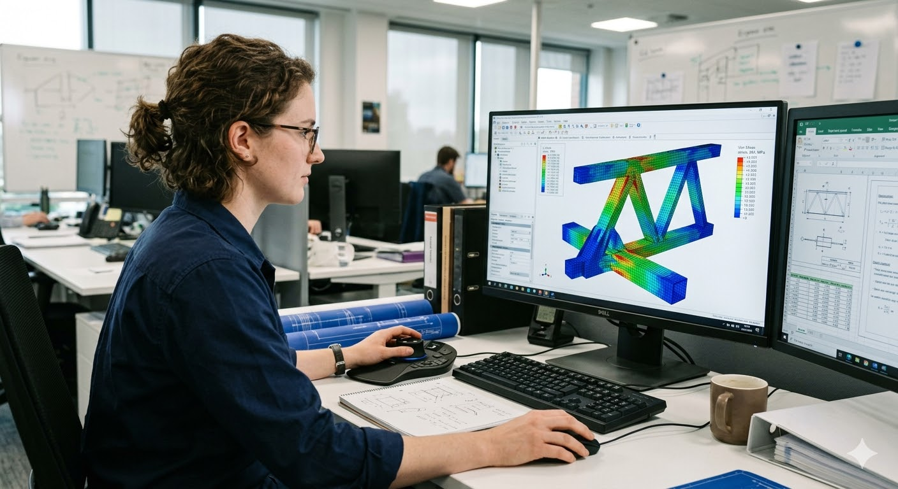

# VSMN20 — Software Development for Technical Applications

*Graduate course · Civil Engineering · Lund University*

This course teaches you how to develop engineering software in Python, with a focus on finite element analysis (FEA) applications. You will build a complete FEM tool from scratch — starting with basic Python programming and ending with a Qt-based graphical user interface, parametric geometry modelling, and ParaView visualisation.

---

## Getting started

!!! tip "New students — start here"
    1. Install the required software using the [Windows](installation_guide_windows.md) or [macOS](installation_guide_macos.md) installation guide.
    2. Open [Worksheet 1](assignment1_eng.md) and work through it before the first supervision session.
    3. Keep the [Links](links.md) page open — it contains all tutorials and documentation you will need.

---

## Prerequisites

!!! info "What you should know before the course"
    - Basic programming experience in any language is helpful but not required.
    - Familiarity with finite element theory at introductory level (e.g. VSMA05 or equivalent).
    - A working laptop with administrator rights to install software.

---

## Course structure

Each worksheet builds directly on the previous one. Your chosen problem type (thermal, groundwater, or plane stress) is used throughout all worksheets.

| Worksheet | Topic | Builds on |
|-----------|-------|-----------|
| [Worksheet 1](assignment1_eng.md) | Python & NumPy fundamentals | — |
| [Worksheet 2](assignment2_eng.md) | Object-oriented FEM solver | WS 1 |
| [Worksheet 3](assignment3_eng.md) | Parametric geometry & GMSH meshing | WS 2 |
| [Worksheet 4](assignment4_eng.md) | Qt graphical user interface | WS 3 |
| [Worksheet 5](assignment5_eng.md) | Parameter studies & ParaView export | WS 4 |
| [Final submission](assignment6.md) | Report & complete application | WS 1–5 |

---

## Tools and libraries

| Tool | Purpose | Used from |
|------|---------|-----------|
| Python (Conda-Forge) | Programming language and environment | WS 1 |
| NumPy / Matplotlib | Numerical arrays and plotting | WS 1 |
| CALFEM for Python | FEM routines (element stiffness, assembly, solvers) | WS 2 |
| GMSH | Automatic mesh generation (included with CALFEM) | WS 3 |
| Qt / PySide6 | Graphical user interface | WS 4 |
| ParaView | 3D result visualisation | WS 5 |

!!! note "Reference guides"
    The [Guides](data_in_tables.md) section contains step-by-step instructions for installing Qt Designer and handling high-DPI displays, as well as a guide to producing formatted tables with the `tabulate` library.
