# Installing Conda-Forge on Windows

This document provides a step-by-step guide to installing Conda-Forge on Windows. Conda-Forge is a community-driven collection of conda packages that are built and maintained by the community. 

## Step 1: Downloading Conda-Forge installer

Go to the [Conda-Forge page](https://conda-forge.org) and download the Anaconda installer for Windows.

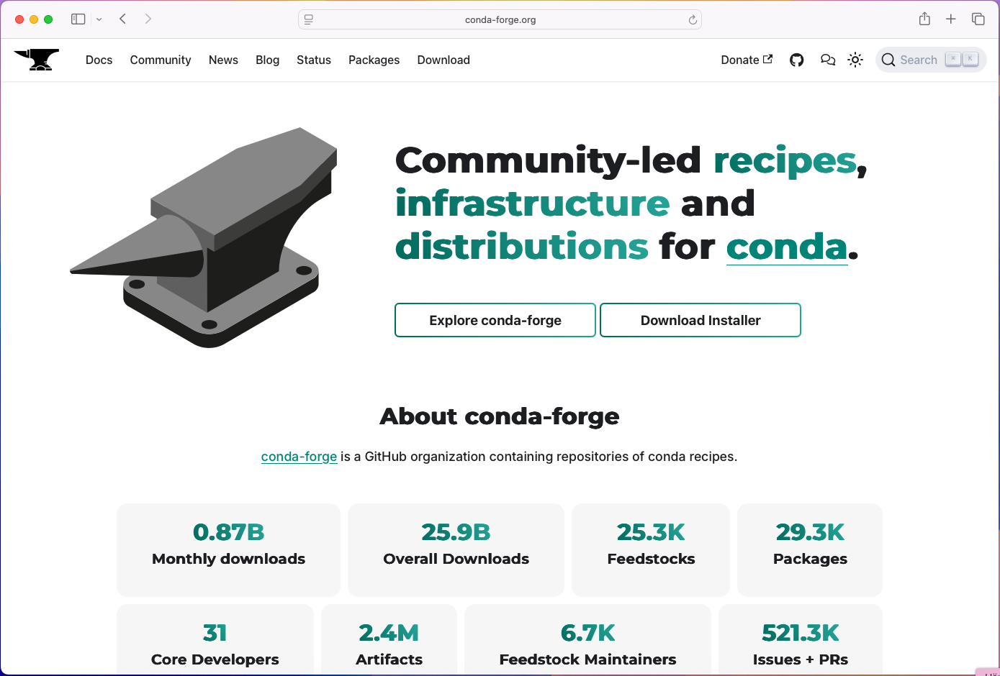

Click on the button **Download Installer**.

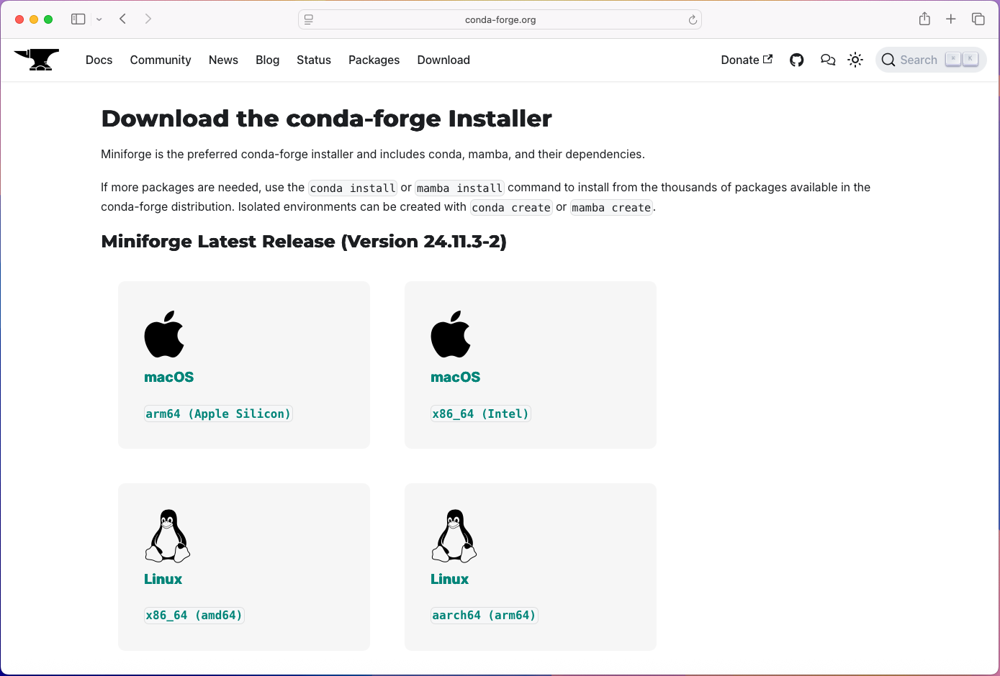

In this step it is important to now if you are using a Intel- or Apple Silicon Mac. If you are using a Intel Mac, click on the **macOS** Button to download the installer for Intel Macs. If you are using an Apple Silicon Mac, click on the **Apple Silicon** Button to download the installer for Apple Silicon Macs.

## Step 2: Installing Conda-Forge

When the download completed the installation needs to be completed in a Terminal. To open a Terminal, press **Command** + **Space** and type in **Terminal**. This will open the Terminal application.

In the terminal we need to navigate to the folder where the installer was downloaded. By default, this is the **Downloads** folder. To navigate to the Downloads folder, run the following command in the terminal:

```bash
cd ~/Downloads
```

We are now ready to start the installer. The installer is a `.sh` file. To start the installation, run the following command in the terminal:

```bash
sh Miniforge3-MacOSX-arm64.sh
```


When the installer starts it shows the license agreement. To accept the license agreement, we need to move down in the text. To do this, press the **Space** key until the end of the license agreement is reached. After that, type in **yes** and press **Enter** to accept the license agreement.

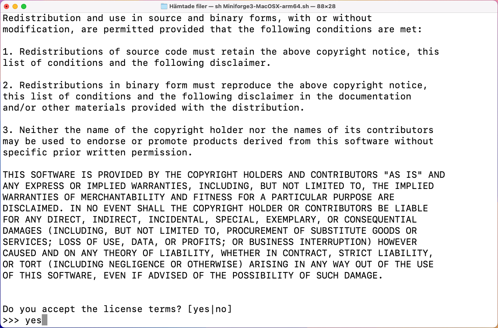

Next you will be asked where to install Conda-Forge. By default, it will be installed in the home directory under the folder **miniforge3**. To accept the default location, press **Enter**. If you want to change the location, type in the new location and press **Enter**.

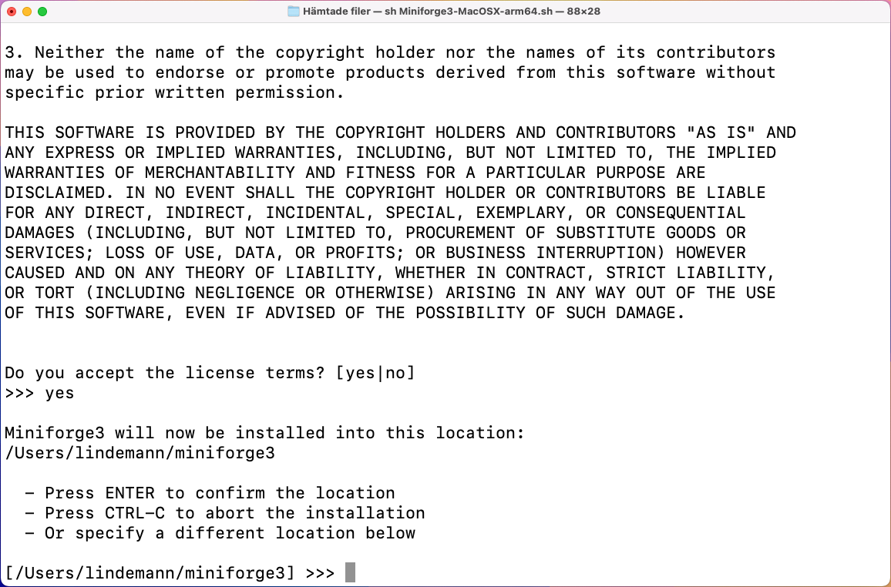

The installer now downloads the required packages. Finally it asks if you would like to configure the shell to use conda by default. This is recommended, so type in **yes** and press **Enter**.

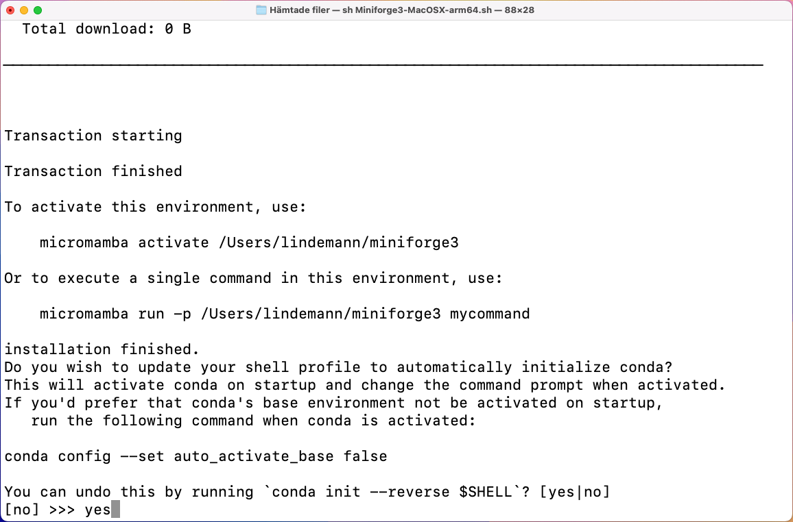

The installation is now complete. Before we use the Conda-Forge, we need to restart the terminal. To do this, close the terminal and open it again. 

The new terminal should look like this:

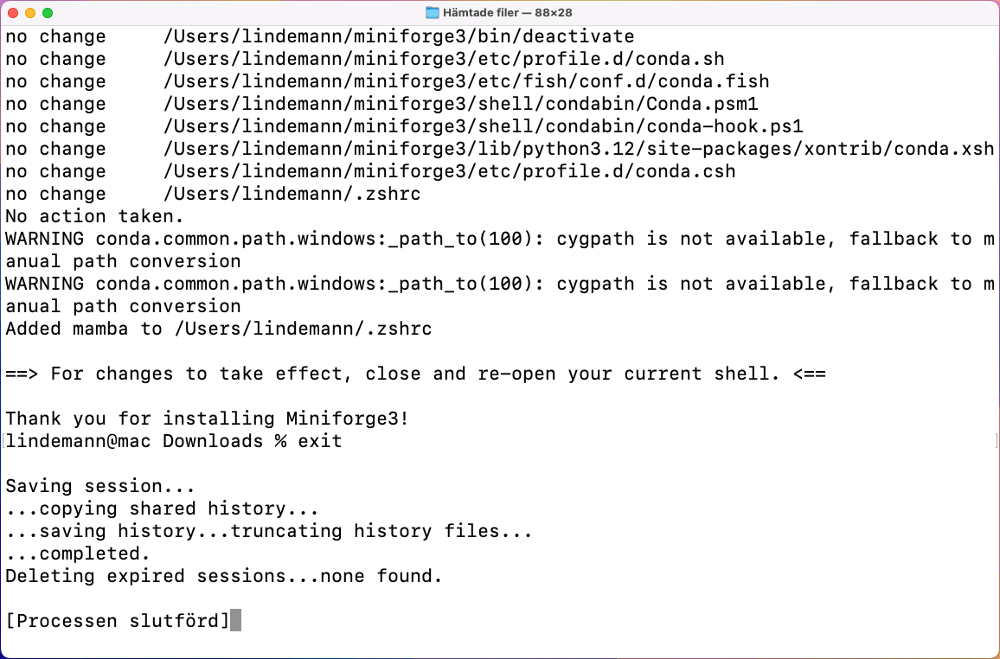

That is there should be a prompt with `(base)` in front of it. This indicates that the Conda-Forge is installed and ready to use.

## Step 3: Creating an envrionment for this course

In the opened terminal we need to create a new environment for this course. An environment is a self contained Python installation with a set of packages. To create a new environment, run the following command in the terminal:

```bash
conda create -n vsmn20 python=3.12 numpy scipy matplotlib
```

This will create a new environment called `vsmn20` with Python 3.12 and the packages `numpy`, `scipy` and `matplotlib`. The command will also install all the dependencies required for these packages. 

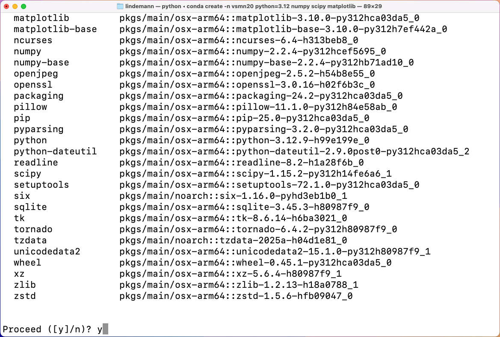

At some point during the installation, you will be asked if you want to proceed with the installation. Type in **y** and press **Enter** to proceed with the installation.

When the installation is complete, you will see a message indicating that the environment has been created and how to activate it.

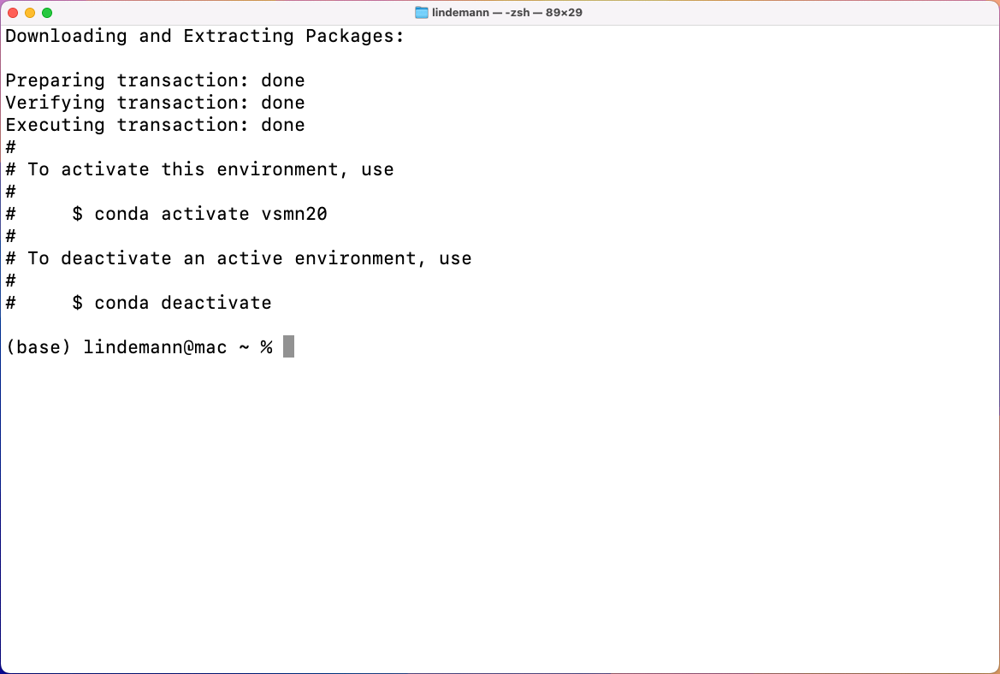

To continue our installation with the packages required for this course, we need to activate the environment. To do this, run the following command in the terminal:

```bash
conda activate vsmn20
```

This will activate the environment and change the prompt to indicate that the environment is active. The prompt should now look like this:

```bash
(vsmn20) user@computer:~$
``` 

In this environment we now have to install CALFEM for Python. We will use a special package manager calle pip to install CALFEM. To do this, run the following command in the terminal:

```bash
pip install calfem-python
```

If all goes well, you should see a message indicating that CALFEM has been installed successfully.

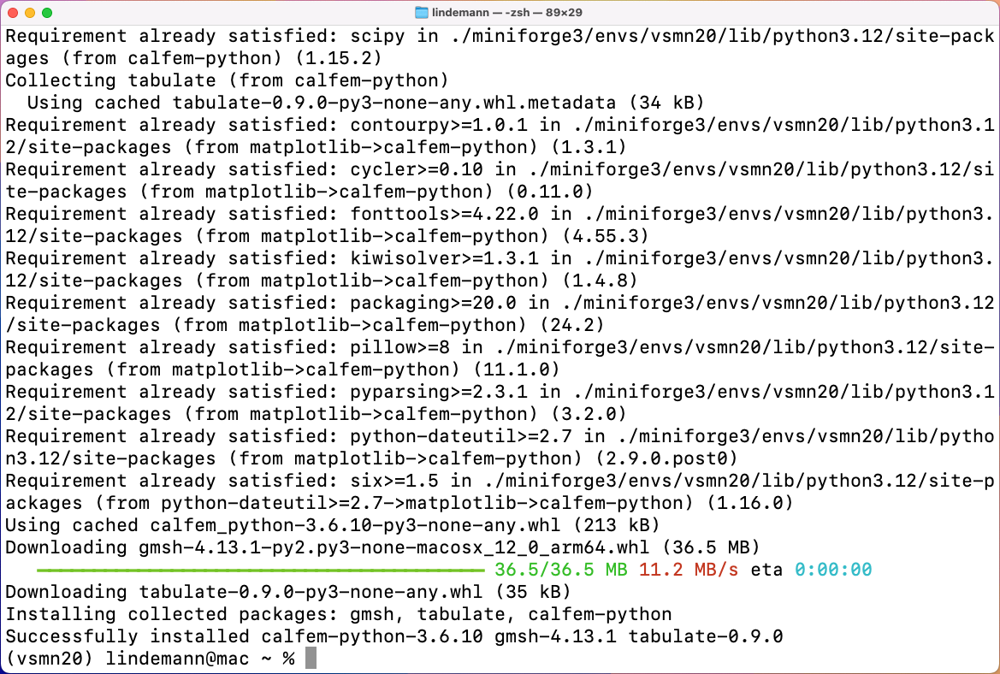

## Step 4: Testing the installation

To test the installation, will open a Python interpreter. To do this, run the following command in the terminal:

```bash
python
```

This will open the Python interpreter. The prompt should now look like this:

```bash
>>> 
```

On this prompt we type in the following command to import CALFEM:

```python
>>> import calfem.core as cfc
>>> help(cfc.beam2e)
```

This shoudl display the following in the terminal:

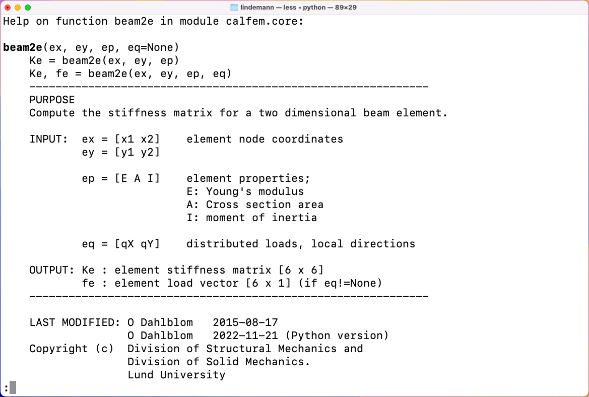

To exit out of this help display press **q**. To exit out of the Python interpreter, type in **exit()** and press **Enter**.

## Step 5: Installing Visual Studio Code

To install Visual Studio Code, go to the [Visual Studio Code page](https://code.visualstudio.com) and download the installer for macOS. Clicking on the Mac download button should automatically select the correct version for your system.

The download comes inthe form of a `.zip` file. 

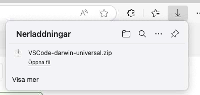

Open the **Downloads** folder. It shoudl look like this:

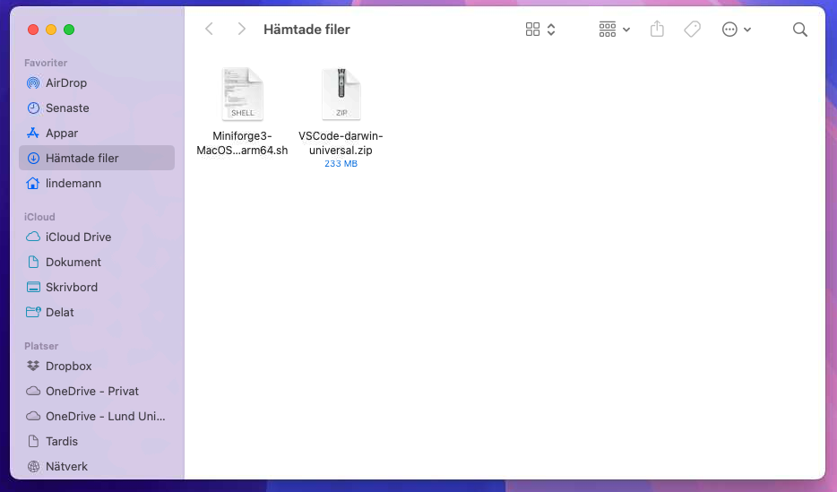

Double click on the downloaded file. This will extract the contents of the zip file. You should see a new icon called **Visual Studio Code**. 

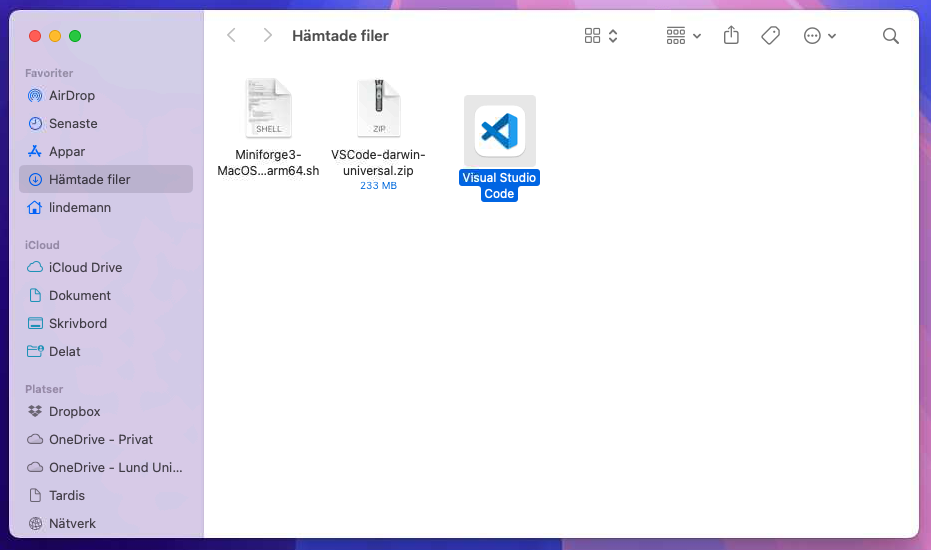

Drag the **Visual Studio Code** icon to the **Applications** folder. This will copy the application to the Applications folder.

To open Visual Studio Code, go to the **Applications** folder and double click on the **Visual Studio Code** icon. You can also search for Visual Studio Code in the **Spotlight** search by pressing **Command** + **Space** and typing in **Visual Studio Code**.

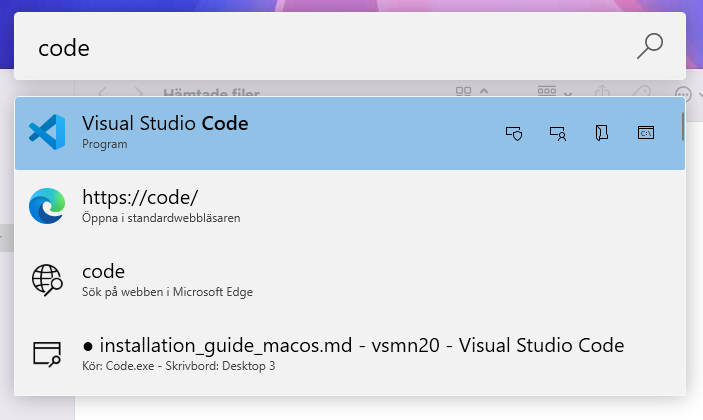

When you open Visual Studio Code for the first time, you will see a welcome screen. You can close this screen by clicking on the **X** in the top right corner.

## Step 6: Installing the Python extension for Visual Studio Code

I the left toolbar click on the **Extensions** icon. This will open the extensions view.


In the search box enter **Python**. This will show the Python extension for Visual Studio Code.
Click on the **Install** button to install the extension.

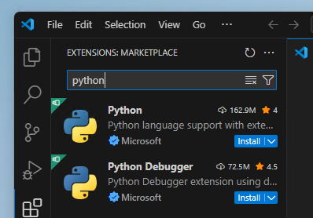

Next, create a new file by clicking on the **File/New file...** in the menu. This will open a file type selection dialog.


In the file type selection dialog select **Python**. This will create a new Python file.

In the next step we will need to select the Python interpreter. This is the Python version that will be used to run the code. To select the Python interpreter, click on the **Select interpreter** icon in the bottom right corner of Visual Studio Code.


This will open a list of available Python interpreters. Select the one that corresponds to the `vsmn20` environment we created earlier. This should be something like `C:\Users\YourUsername\Miniforge3\envs\vsmn20\python.exe`.


When this has been done, everytime you open a Python file in Visual Studio Code, it will show a play button in the top right corner. This will run the code in the file using the selected Python interpreter. Below shows what happens when you click on the play button.


