# Installing Conda-Forge on Windows

This document provides a step-by-step guide to installing Conda-Forge on Windows. Conda-Forge is a community-driven collection of conda packages that are built and maintained by the community. 

## Step 1: Downloading Conda-Forge installer

Go to the [Conda-Forge page](https://conda-forge.org) and download the Anaconda installer for Windows.


Click on the button **Download Installer**.

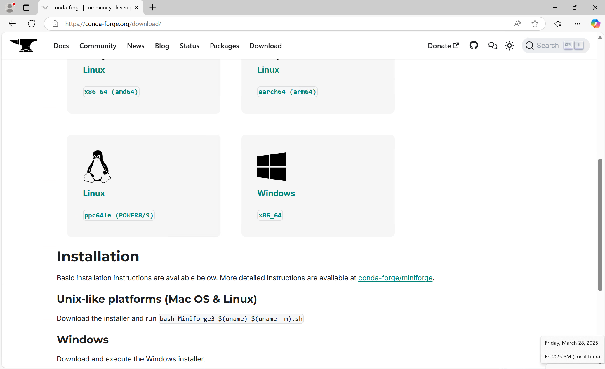

Click on the **Windows** Button to download the installer for Windows.

A download message will appear on the top right corner of your browser. Click on the **Open file** when the download has completed.

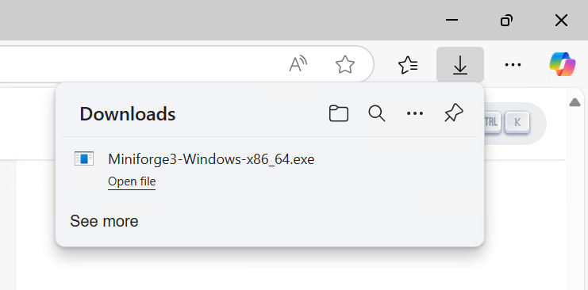

## Step 2: Installing Conda-Forge

When the installer opens, you will see a welcome screen. 

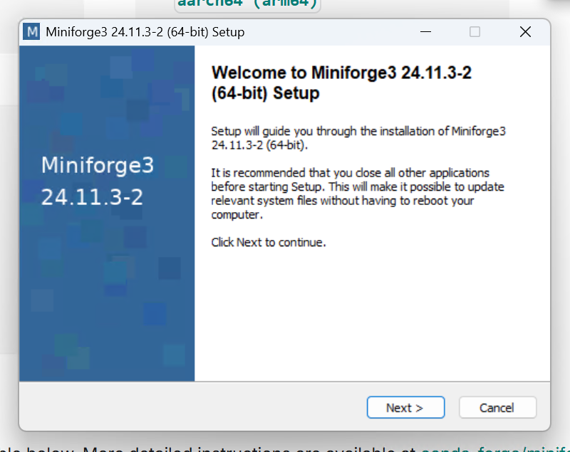

Click on **Next** to continue. The following page will be displayed:

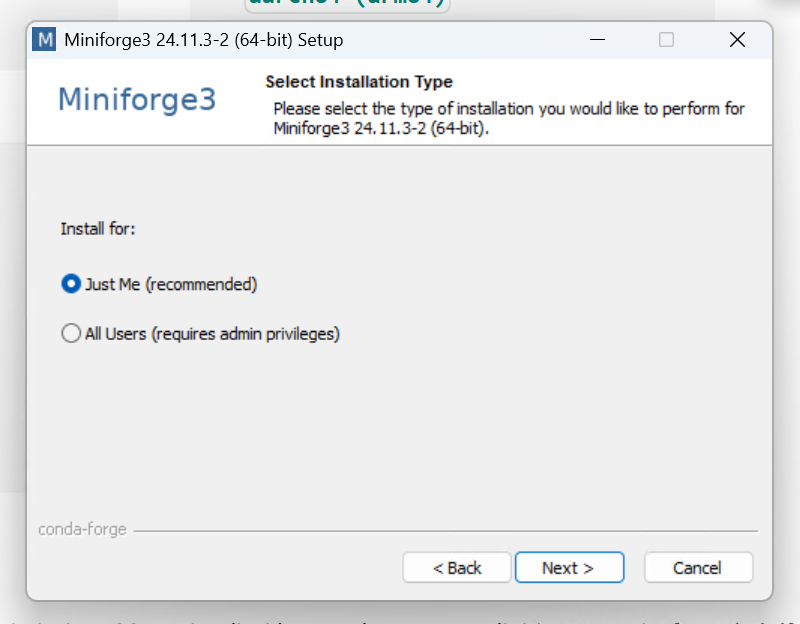

Select the option **Install only for me** and click on **Next**. The following page will be displayed:

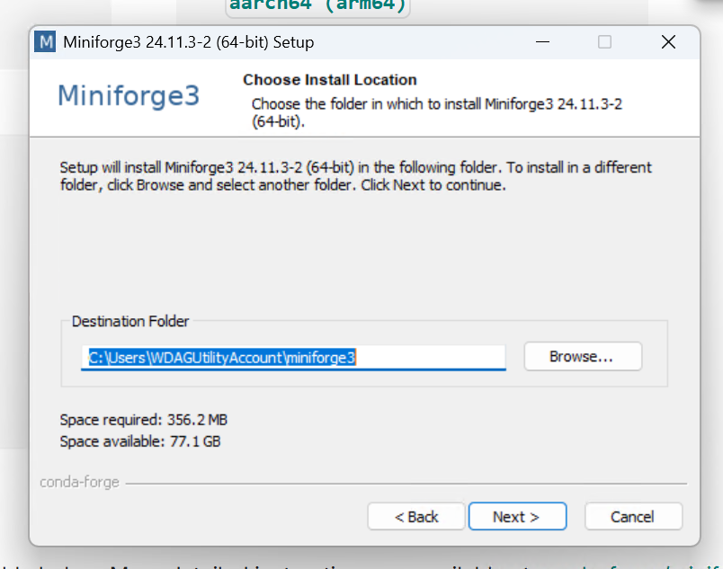

Leave the suggested location for the installation and click on **Next**. The following page will be displayed:

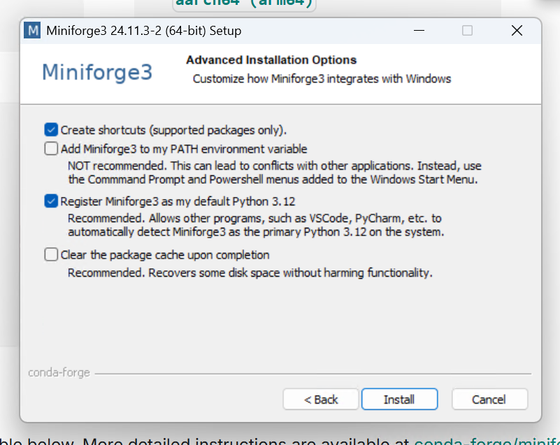

Here it is important to select the option "Register Anaconda as my default Python 3.x". This will ensure that the Conda-Forge packages are available in your Python environment. Click on **Next** to continue. The installation of Conda-Forge will start and the following page will be displayed:

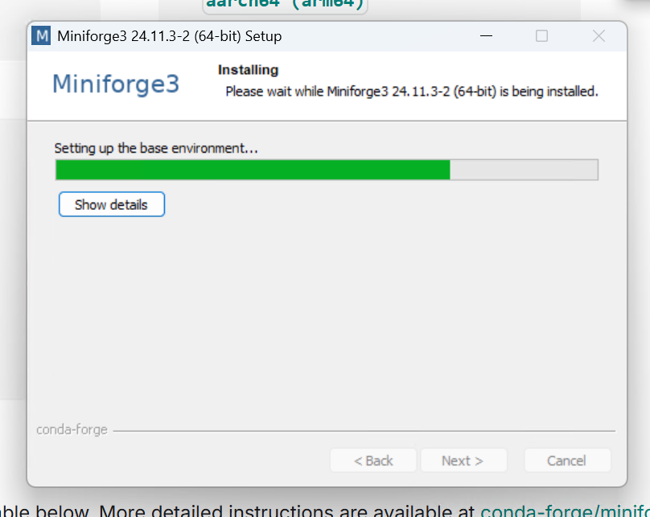

When this dialog has finished the Conda-Forge installation is complete.

## Step 3: Opening an Miniforge prompt

Press the **Start** button in Windows. This should bring up the following menu.

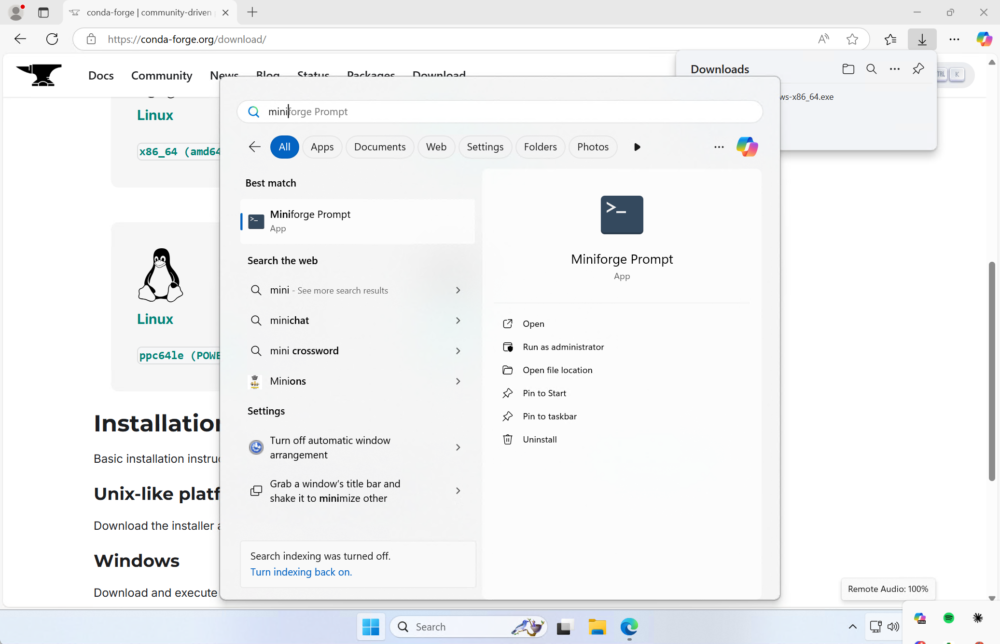

In the top part of the start menu enter miniforge. This should show the shortcut for the Miniforge prompt. Click on the **Miniforge Prompt** to open a command line window as shown below:

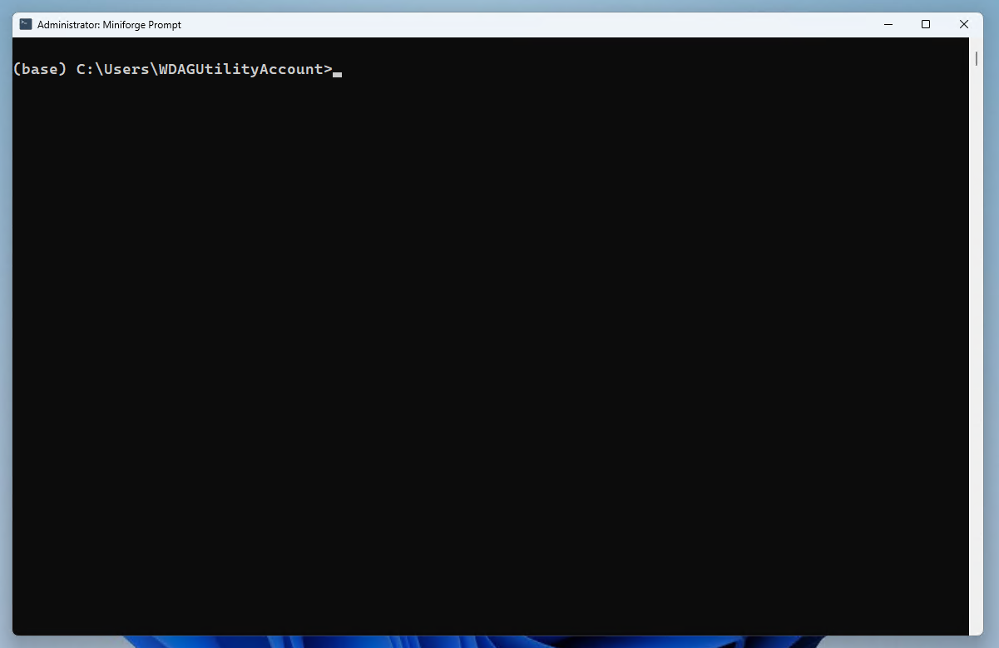

To install the required packages for this course we create an environment. An environment is a self-contained installation of Python with its own set of packages. This allows you to have multiple versions of Python and packages installed on your system without conflicts. To create an environment called `vsmn20` with Python 3.8, run the following command in the Miniforge prompt:

```cmd
conda create -n vsmn20 python=3.8 numpy scipy matplotlib
```

Running this command will check for the required packages and their dependencies. If everything is ok, you will be prompted to confirm the installation. Type `y` and press enter to continue.

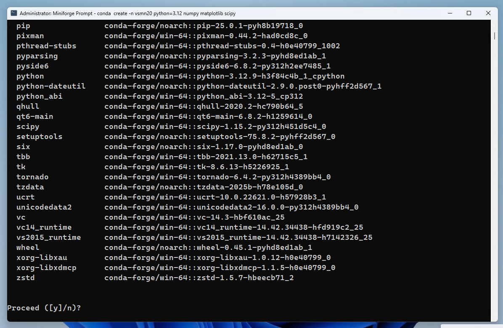

When the installation completes, you will see the following message:

```cmd
Downloading and Extracting Packages:

Preparing transaction: done
Verifying transaction: done
Executing transaction: done
#
# To activate this environment, use
#
#     $ conda activate vsmn20
#
# To deactivate an active environment, use
#
#     $ conda deactivate
```

To use this environment in the future, you need to activate it. To do this, run the following command in the Miniforge prompt:

```cmd
conda activate vsmn20
```

This will activate the `vsmn20` environment and you will see the following message:

```cmd
(vsmn20) C:\Users\YourUsername>
```

This indicates that you are now in the `vsmn20` environment and any packages you install or run will be from this environment.
To deactivate the environment, run the following command:

```cmd
conda deactivate
```

This will deactivate the `vsmn20` environment and return you to the base environment.

## Step 4: Installing additional packages

In this course there are additional packages required that are not included in the default installation of Conda-Forge. To install these packages make sure the `vsmn20` environment is activated and run the following command: 

```cmd
conda activate vsmn20
```

To install the additional packages we will ue the `pip` command. This is a package manager for Python that allows you to install packages from the Python Package Index (PyPI). Using `pip` we will install CALFEM.

```cmd
pip install calfem
```

When the installation is complete you will see the following message:

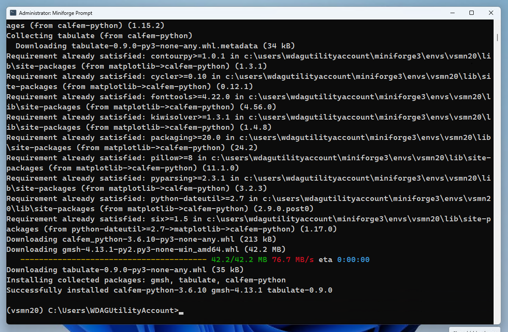

## Step 5: Installing Visual Studio Code

Download Visual Studio Code from here:

https://code.visualstudio.com/Download

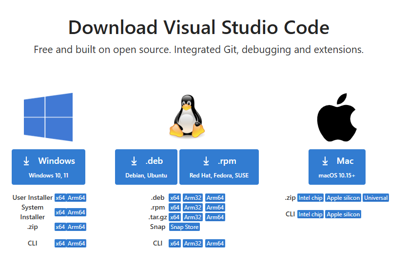

Click on the **open file** when the download has completed.

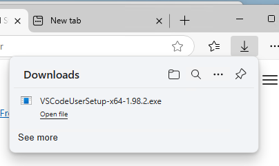

When running the installer the first time it will show a warning that the installer is not meant to be run as an administrator. This is OK. Press **OK** to continue.

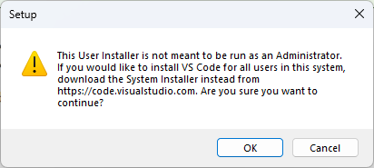

A welcom page is shown asking you to accept the license agreement. Press **I accept the agreement** and click on **Next**.


Next a page is shown where you can select the installation folder. Leave the default folder and click on **Next**.

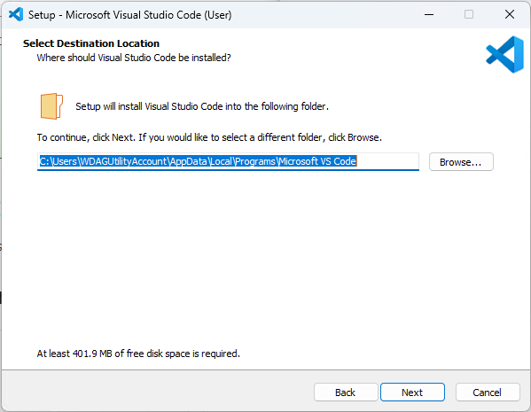

In the next page just accept the default name of the shortcut to be created. Click on **Next**.

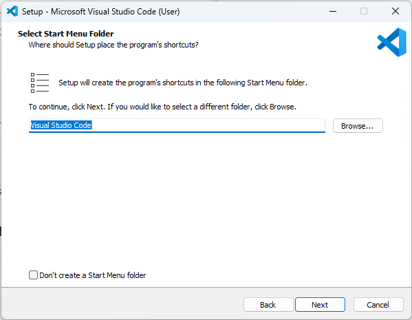

In the next page it is important that you select all checkboxes. This will ensure that Visual Studio Code is added to the PATH and that the file types are associated with Visual Studio Code. Click on **Next**.

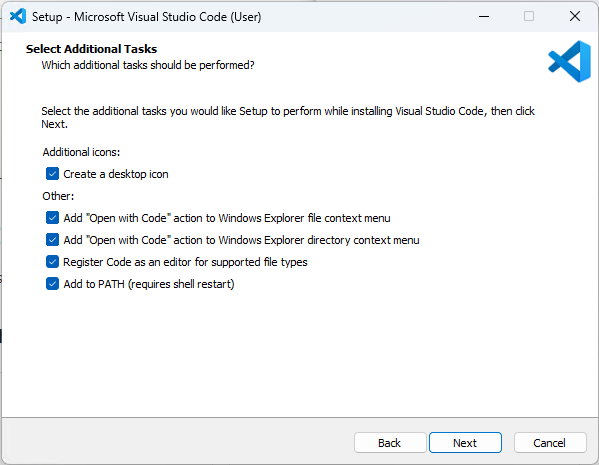

Click on **Install** to start the installation.

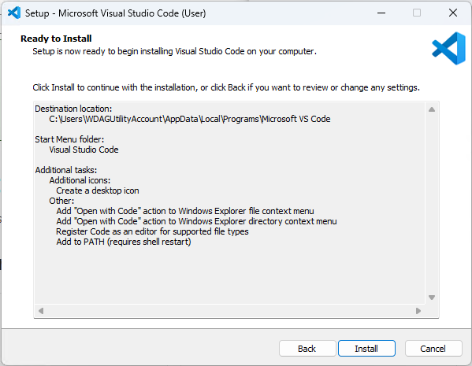

When the installation is complete, you will see the following message:

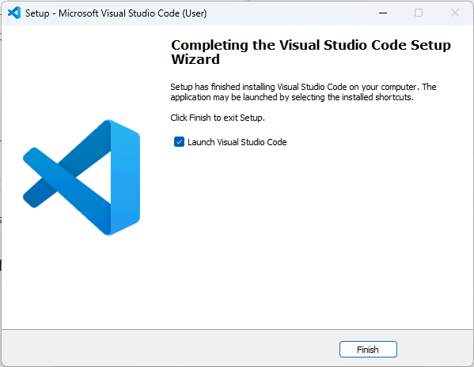

Leave the checkbox **Launch Visual Studio Code** checked and click on **Finish**.
This will start Visual Studio Code.

## Step 6: Installing the Python extension for Visual Studio Code

I the left toolbar click on the **Extensions** icon. This will open the extensions view.

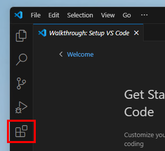

In the search box enter **Python**. This will show the Python extension for Visual Studio Code.
Click on the **Install** button to install the extension.


Next, create a new file by clicking on the **File/New file...** in the menu. This will open a file type selection dialog.


In the file type selection dialog select **Python**. This will create a new Python file.

In the next step we will need to select the Python interpreter. This is the Python version that will be used to run the code. To select the Python interpreter, click on the **Select interpreter** icon in the bottom right corner of Visual Studio Code.


This will open a list of available Python interpreters. Select the one that corresponds to the `vsmn20` environment we created earlier. This should be something like `C:\Users\YourUsername\Miniforge3\envs\vsmn20\python.exe`.


When this has been done, everytime you open a Python file in Visual Studio Code, it will show a play button in the top right corner. This will run the code in the file using the selected Python interpreter. Below shows what happens when you click on the play button.


