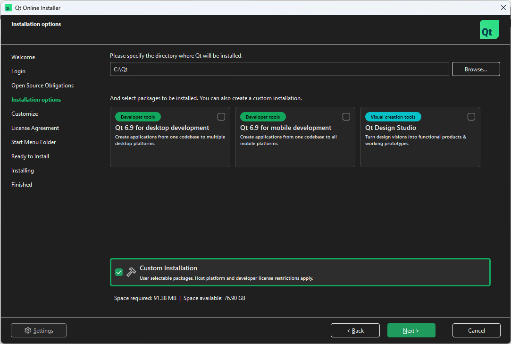
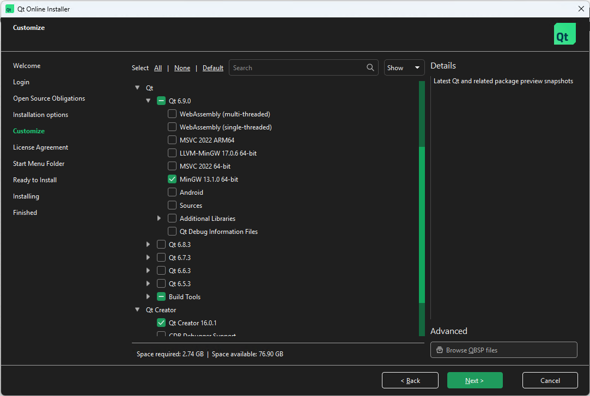
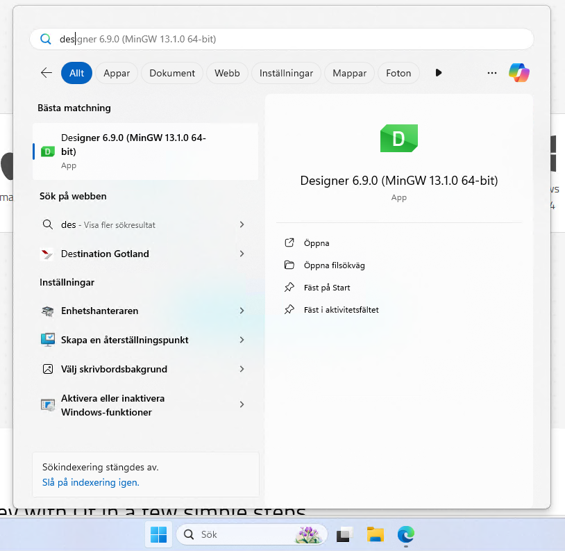

# Installing Qt Designer

Qt Designer is a powerful tool for designing and building graphical user interfaces (GUIs) using the Qt framework. It allows you to create complex layouts and widgets visually, without writing code. 

As Qt Designer is not part of the Anaconda distribution, you will need to install it separately. This document provides instructions for installing Qt Designer on Windows, macOS, and Linux.

## Installing using the Qt installer

First we need to download the Qt installer. The Qt installer is a graphical installer that allows you to install Qt and its components. It is available for Windows, macOS, and Linux. To download the Qt installer, follow these steps:

 1. Go to the [Qt download page](https://www.qt.io/download) and download the Qt installer for your operating system.

 2. To use the installer you need to create a Qt account. This is free and you can use your email address to create an account. Once you have created an account, you will be able to download the installer.

 3. When you come to the Installation option page unselect the Qt 6.x for desktop development and instead select the Custom Installation option. This will allow you to select the required components so that Qt Designer is installed. Before continuing, make sure that the options are set as shown in the image below:

 

 4. Click on the **Next** button to continue. This will show a list of components that can be installed. Make sure the components as shonw in the image below are selected:

 

Finally complete the installer by continuing with the installation. This will install Qt Designer and the required components.

If everything went well, you should be able to find Qt Designer in the start menu (Windows) or in the Applications folder (macOS).

!!! Note

    Installing on macOS is a similar process. Select the **Custom Installation** option and select the required components. The installation process is similar to the one on Windows.
    The only difference is that the Qt Designer will be installed in the Applications folder instead of the start menu.

## If all else fails

There is also another more unsupported way to install Qt Designer, by using Michael Herrmann's precompiled binaries. This is not recommended as it is not an official installation method and may not work as expected. However, if you want to try it, you can find the precompiled binaries on [Michael Herrmann's GitHub page](https://build-system.fman.io/qt-designer-download)